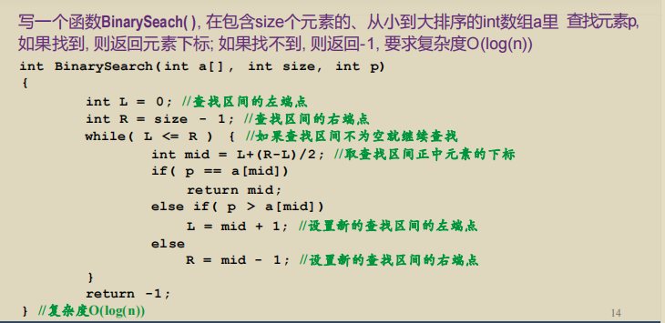

[toc]

==const成员变量必须初始化，否则会报错==

# 第十二讲（String类)

## 定义

- string类是一个模板类，他的定义如下：

typedef basic_stringstring

------

- typedef 在 C++ 中是一个关键字，它给一个已有的数据类型提供一个新的名称。当你看到 typedef basic_string string; 这行代码时，它的意思是给 basic_string 类型起了一个新的别名 string。

basic_string 是 C++ 标准库中的一个模板类，它用于表示和操作字符串。basic_string 可以被实例化为不同的字符类型，如 char, wchar_t, char16_t, char32_t 等，从而允许创建不同字符类型的字符串。

当 basic_string 被实例化为 char 类型时，就是我们常说的 std::string。这行代码实际上就是在定义 std::string 类型，它是 basic_string 的一个特化版本，通常用于处理标准的 ASCII 和 UTF-8 字符串。

在很多 C++ 环境中，这种 typedef 是不必要的，因为  头文件中已经包含了类似的定义，即 typedef basic_string string; 已经存在于命名空间 std 中，所以你可以直接使用 std::string 而无需自己定义。

总结一下，这行代码就是定义了一个类型别名，使得 basic_string 可以简单地通过 string 来引用。这样做的好处是使代码更加简洁明了，尤其是在需要频繁使用 basic_string 类型的情况下。

------

- 使用string类要包含头文件#include
- string类对象的初始化

string s1("hello")；//一个参数的构造函数

string s2(8,'x')//两个参数的构造函数

string month="March"

- 注意：类中不提供以字符和整数为参数为参数的构造函数
- 错误的初始化方法
  - string error1='c'//错
  - string error2('u')//错
  - string error3=22//错
  - string error4(8)//错
- 可以将字符赋值给string对象
  - s='n';

**实例**

​	


```c++
	#include <iostream>
	#include <string>
	using namespace std;
	int main(int argc, char* argv[ ]){
	string s1("Hello");
	cout << s1 << endl;
	string s2(8, 'x');
	cout << s2 << endl;
	string month = "March"; 
	cout << month << endl;
	string s;
	s='n';
	cout << s << endl;
	return 0;
	}
	输出：
	Hello
	xxxxxxxx
	March

	n
```


**一些注意：**

- 构造的string太长二无法表达时会抛出length_error异常
- string对象的长度用成员函数length()读取
  - string s("hello");
  - cout<
- string 支持流读取运算符
  - string string_object
  - cin>>string_object
- string 支持getline函数
  - string s;
  - getline(cin,s)

- - 
  

## 构造函数

string 类有多个构造函数，用法如下

- string s1(); //s1=""
- string s2("hello");//s2="hello"
- string s3(4,'k');//s3="kkkk"
- string s4("12345",1,3);s4="234",即“12345”的下标1开始，长度为1的子串

不能直接这样写

- *string s1('k')*
- *string s2(123)*

## 赋值

**string的赋值和连接**

- 用=赋值
  - string s1("cat"),s2;
  - s2=s1
- 用assign成员函数复制
  - string s1("cat"),s3
  - s3.assign(s1)
- 用assign成员函数部分赋值
  - string s1("cating"),s3;
  - s3.assign(s1,1,3);

- s2.assign(4,'k')

## 字符串长度

length 成员函数返回字符串的长度.size成员函数实现同样的功能

## string 对象中字符串的连接

- 可以使用**+**和**+=**运算符对string对象进行链接操作

- append 成员函数

  - **string s1("good "), s2("morning!");**

    **s1.append(s2);**

    **cout << s1;**//s1=good morning

    **s2.append(s1, 3, s1.size());** 

    **cout << s2;**//morningd


## 比较string ##

### 1.运算符比较：=，>,>=,<,<=,!=

返回值都是bool类型，成立返回true,否则返回 false


  

  ### 2.用成员函数compare 比较

```c++
string s1("hello"), s2("hello"), s3("hell");

int f1 = s1.compare(s2);

int f2 = s1.compare(s3);

int f3 = s3.compare(s1);

int f4 = s1.compare(1, 2, s3, 0, 3); 

int f5 = s1.compare(0, s1.size(), s3); 

cout << f1 << endl << f2 << endl << f3 << endl;

cout << f4 << endl << f5 << endl;
输出：
    0
    1
    -1
    -1
    1
```

## string 对象的子串

- substr 成员函数可以用于求字串(n,m)，原型如下：

  - string substr(int n=0,int m=string::npos)const;//可以求出字串(n,m)

  - ```c++
    - - - string s1="this is ok";
        - string s2=s1.substr(2,4);//s2="is i"
        - s2=s1.substr// s2="is is ok"
    
    ```


## 交换两个string 对象的内容

用swap函数

s1.swap(s2);//交换s1,s2

  ## string的特性

1.成员函数 ```capacity()```:

- 返回无需增加内存即可存放的字符数

2.成员函数```max_size```:

- 返回string对象可存放的字符数

3.成员函数length()和size（）相同

- 返回字符串的大小或者长度

4.成员函数```empty()```:

- 返回string对象是否为空

5.成员函数```resize()```

- 改变string对象的长度


## 查找子串和字符

___

在介绍`string`类中查找子串和字符的成员函数之前，值得一提的是，这些功能主要存在于多种编程语言中的字符串处理库或类中，例如C++、Python、Java等。下面我将以C++的`std::string`为例来介绍，因为它提供了一系列丰富的成员函数来支持字符串的查找操作。

`std::string`中的查找函数

 查找子串

 `find`

- **原型**: `size_type find(const string& str, size_type pos = 0) const;`
- **描述**: 在字符串中从位置`pos`开始查找子串`str`第一次出现的位置。
- **返回值**: 如果找到子串，则返回子串第一次出现的索引；如果没有找到，则返回`string::npos`。

 `rfind`

- **原型**: `size_type rfind(const string& str, size_type pos = npos) const;`
- **描述**: 从字符串中的`pos`位置开始（默认为字符串的末尾），向前查找子串`str`最后一次出现的位置。
- **返回值**: 如果找到，则返回子串最后一次出现的位置；如果没有找到，则返回`string::npos`。

 查找单个字符

 `find_first_of`

- **原型**: `size_type find_first_of(const string& str, size_type pos = 0) const;`
- **描述**: 从字符串的`pos`位置开始查找任何一个属于`str`中的字符第一次出现的位置。
- **返回值**: 如果找到，则返回第一个匹配字符的位置；如果没有找到，则返回`string::npos`。

 `find_last_of`

- **原型**: `size_type find_last_of(const string& str, size_type pos = npos) const;`
- **描述**: 从字符串中的`pos`位置开始向前查找任何一个属于`str`中的字符最后一次出现的位置。
- **返回值**: 如果找到，则返回最后一个匹配字符的位置；如果没有找到，则返回`string::npos`。
 查找不在参数中的第一个字符

 `find_first_not_of`

- **原型**: `size_type find_first_not_of(const string& str, size_type pos = 0) const;`
- **描述**: 从字符串的`pos`位置开始查找第一个不属于`str`中的字符。
- **返回值**: 如果找到，则返回第一个不匹配字符的位置；如果没有找到，则返回`string::npos`。

 `find_last_not_of`

- **原型**: `size_type find_last_not_of(const string& str, size_type pos = npos) const;`
- **描述**: 从字符串中的`pos`位置开始向前查找最后一个不属于`str`中的字符。
- **返回值**: 如果找到，则返回最后一个不匹配字符的位置；如果没有找到，则返回`string::npos`。

这些函数为在字符串中进行搜索和查找提供了强大的工具，允许开发者以不同的方式查询字符串中的子串或字符，以及它们的位置信息。

```c++
#include <iostream>
#include <string>

int main() {
    std::string str = "Hello, World! Programming is fun.";

    // find
    size_t pos = str.find("World");
    if (pos != std::string::npos) {
        std::cout << "'World' found at position: " << pos << std::endl;
    }

    // rfind
    pos = str.rfind("o");
    if (pos != std::string::npos) {
        std::cout << "Last 'o' found at position: " << pos << std::endl;
    }

    // find_first_of
    pos = str.find_first_of("aeiou");
    if (pos != std::string::npos) {
        std::cout << "First vowel found at position: " << pos << std::endl;
    }

    // find_last_of
    pos = str.find_last_of("aeiou");
    if (pos != std::string::npos) {
        std::cout << "Last vowel found at position: " << pos << std::endl;
    }

    // find_first_not_of
    pos = str.find_first_not_of("Hello, World!");
    if (pos != std::string::npos) {
        std::cout << "First character not in 'Hello, World!' found at position: " << pos << std::endl;
    }

    // find_last_not_of
    pos = str.find_last_not_of("fun.");
    if (pos != std::string::npos) {
        std::cout << "Last character not in 'fun.' found at position: " << pos << std::endl;
    }

    return 0;
}
输出值：
    给定示例代码和初始字符串`"Hello, World! Programming is fun."`，让我们逐个查看每个函数调用的预期输出：

1. `find("World")`将找到子串"World"第一次出现的位置，这是从位置6开始（记住，字符串索引从0开始）。
   
   输出：`'World' found at position: 7`

2. `rfind("o")`会查找最后一次出现的字符"o"的位置，这在"Programming"这个词中，位置24。
   
   输出：`Last 'o' found at position: 24`

3. `find_first_of("aeiou")`将找到第一个出现的元音字母，这里是"e"在"Hello"中的位置1。
   
   输出：`First vowel found at position: 1`

4. `find_last_of("aeiou")`查找最后一个出现的元音字母，这里是"u"在"fun"中的位置27。
   
   输出：`Last vowel found at position: 27`

5. `find_first_not_of("Hello, World!")`查找第一个不在给定集合中的字符。考虑到整个"Hello, World!"字符串都在初始字符串中，它将查找到"Programming"中的"P"，这是在位置13开始。
   
   输出：`First character not in 'Hello, World!' found at position: 13`

6. `find_last_not_of("fun.")`将查找最后一个不在"fun."中的字符，这是"g"在"Programming"的末尾，位置22。
   
   输出：`Last character not in 'fun.' found at position: 22`

请注意，上述输出基于索引从0开始的约定，并且假设没有对原始字符串`"Hello, World! Programming is fun."`进行修改。在实际操作中，字符串的处理和查找结果可能会受到编码、环境设置或库实现的细微差异影响。
```

___

## 替换子串

在C++中，`std::string`的`replace`成员函数非常强大，可以以多种方式替换字符串的一部分。这里给出几个示例，展示`replace`函数的不同用法：

### 1. 替换指定位置的字符

```cpp
#include <iostream>
#include <string>

int main() {
    std::string str = "Hello, World!";
    // 替换位置6开始的5个字符
    str.replace(7, 5, "Universe");
    std::cout << str << std::endl;  // 输出: Hello, Universe!
    return 0;
}
```

### 2. 使用另一个字符串替换

```cpp
#include <iostream>
#include <string>

int main() {
    std::string str = "I love programming in C++";
    std::string toInsert = "Python";
    // 从位置22开始替换6个字符
    str.replace(22, 6, toInsert);
    std::cout << str << std::endl;  // 输出: I love programming in Python
    return 0;
}
```

### 3. 使用字符数组替换

```cpp
#include <iostream>
#include <string>

int main() {
    std::string str = "Goodbye Blue Sky";
    // 从位置8开始替换3个字符
    str.replace(8, 4, "Morning");
    std::cout << str << std::endl;  // 输出: Goodbye Morning Sky
    return 0;
}
```

### 4. 使用另一个字符串的部分替换

```cpp
#include <iostream>
#include <string>

int main() {
    std::string str1 = "Fast and Furious";
    std::string str2 = "Slowly but surely";
    // 从str1的位置9开始替换7个字符，用str2的位置0开始的6个字符替换
    str1.replace(9, 7, str2, 0, 6);
    std::cout << str1 << std::endl;  // 输出: Fast and Slowly
    return 0;
}
```

### 5. 使用迭代器和字符串替换

```cpp
#include <iostream>
#include <string>

int main() {
    std::string str = "The rain in Spain";
    // 使用迭代器定位开始和结束位置
    str.replace(str.begin() + 4, str.end() - 5, "sun shines brightly in");
    std::cout << str << std::endl;  // 输出: The sun shines brightly in Spain
    return 0;
}
```

这些例子展示了`std::string::replace`方法的灵活性和强大功能，它可以接受不同类型的参数来替换字符串的一部分，包括另一个字符串、字符数组、甚至是另一个字符串的一部分。

## 删除子串

在C++中，`std::string`的`erase`成员函数用于删除字符串中的一部分内容，它有几种不同的用法。下面是一些示例，展示了`erase`函数的不同使用方式：

### 1. 删除指定位置的单个字符

```cpp
#include <iostream>
#include <string>

int main() {
    std::string str = "Hello, World!";
    // 删除位置6的字符
    str.erase(6, 1);
    std::cout << str << std::endl;  // 输出: Hello World!
    return 0;
}
```

### 2. 删除指定位置开始的多个字符

```cpp
#include <iostream>
#include <string>

int main() {
    std::string str = "Programming is fun";
    // 从位置11开始删除3个字符
    str.erase(11, 3);
    std::cout << str << std::endl;  // 输出: Programming fun
    return 0;
}
```

### 3. 使用迭代器删除单个字符

```cpp
#include <iostream>
#include <string>

int main() {
    std::string str = "Example";
    // 使用迭代器删除第一个字符
    str.erase(str.begin());
    std::cout << str << std::endl;  // 输出: xample
    return 0;
}
```

### 4. 使用迭代器删除一段字符

```cpp
#include <iostream>
#include <string>

int main() {
    std::string str = "This is a test";
    // 使用迭代器删除" is a"这一段
    str.erase(str.begin() + 4, str.begin() + 9);
    std::cout << str << std::endl;  // 输出: This test
    return 0;
}
```

### 5. 删除整个字符串内容

```cpp
#include <iostream>
#include <string>

int main() {
    std::string str = "Delete me";
    // 删除整个字符串内容
    str.erase();
    // 检查字符串是否为空
    if(str.empty()) {
        std::cout << "String is empty" << std::endl;
    } else {
        std::cout << str << std::endl;
    }
    // 输出: String is empty
    return 0;
}
```

这些例子展示了`std::string::erase`方法的多样性。通过指定不同的参数，可以精确控制需要删除字符串中内容的位置和长度。使用迭代器进行删除操作则提供了更高的灵活性，特别是当需要删除特定范围的字符时。

## 插入字符串

```insert``` 函数

在C++中，`std::string`的`insert`成员函数用于在字符串的指定位置插入字符或字符串，增加了字符串操作的灵活性。以下是`insert`函数的一些用法示例：

### 1. 在指定位置插入字符串

```cpp
#include <iostream>
#include <string>

int main() {
    std::string str = "Hello World";
    // 在位置5插入一个逗号和空格
    str.insert(5, ", ");
    std::cout << str << std::endl;  // 输出: Hello, World
    return 0;
}
```

### 2. 在指定位置插入另一个字符串的一部分

```cpp
#include <iostream>
#include <string>

int main() {
    std::string str1 = "I love C++";
    std::string str2 = " and Python";
    // 在str1的末尾插入str2的全部内容
    str1.insert(str1.size(), str2);
    std::cout << str1 << std::endl;  // 输出: I love C++ and Python
    return 0;
}
```

### 3. 使用迭代器在指定位置插入字符串

```cpp
#include <iostream>
#include <string>

int main() {
    std::string str = "123456";
    // 在位置3插入字符串"ABC"
    str.insert(str.begin() + 3, 'A');
    std::cout << str << std::endl;  // 输出: 123A456
    return 0;
}
```

### 4. 在指定位置插入多个相同字符

```cpp
#include <iostream>
#include <string>

int main() {
    std::string str = "xxxxxx";
    // 在位置3插入5个'O'字符
    str.insert(3, 5, 'O');
    std::cout << str << std::endl;  // 输出: xxxOOOOOxxx
    return 0;
}
```

### 5. 使用迭代器在指定位置插入字符序列

```cpp
#include <iostream>
#include <string>

int main() {
    std::string str = "abcdef";
    // 在位置3之前插入从"1234"的第1个位置开始的2个字符
    str.insert(str.begin() + 3, 'X');
    std::cout << str << std::endl;  // 输出: abcXdef
    return 0;
}
```

### 6. 在指定位置插入另一个字符串的指定部分

```cpp
#include <iostream>
#include <string>

int main() {
    std::string str1 = "I use C++";
    std::string str2 = " and Python";
    // 在str1的末尾插入str2的前10个字符
    str1.insert(str1.size(), str2, 0, 9);
    std::cout << str1 << std::endl;  // 输出: I use C++ and Pytho
    return 0;
}
```

这些例子展示了`std::string::insert`方法的多样化用法，通过不同的参数组合可以在字符串的任意位置插入字符、字符串或者字符序列，极大地提升了字符串操作的灵活性和便利性。

## 转换成C语言式char * 字符串

成员函数```copy()```

```cpp
string s1("helloworld");
int len = s1.length();
char * p2 = new char[len+1];
s1.copy(p2, 5, 0);
p2[5]=0;
cout << p2 << endl;
//hello
```

s1.copy(p2,5,0)从s1的下表0的字符开始制作一个最长5个字符长度的字符串副本并将其赋值给p2，


## 将string 对象作为流处理

```cpp
#include<iostream>
#include<sstream>
#include<string>
using namespace std;
int main(){
	string src("Avatar 123 5.2 Titanic K");
	istringstream istrStream(src);//建立src到istrStream的联系
	string s1,s2;
	int n;double d;char c;
	istrStream>>s1>>n>>d>>s2>>c;//把src的内容当作输入流进行读取
	ostringstream ostrStream;
	ostrStream<<s1<<endl<<s2<<endl<<n<<endl<<c<<endl;
	cout<<ostrStream.str();
	return 0;
}
```

*输出*


  

- 第12行，将变量的值输出到流ostrStream.输出结果被保存在ostrStream对象管理的某处。用ostringstream类的str成员函数呢个将输出到ostringstream对象中的内容提取出来

其输出本质上还要依赖于cout

成员函数

## 用STL算法操作string对象

### STL

____


STL（Standard Template Library，标准模板库）算法是C++标准库的一部分，提供了一系列基于模板的通用算法，用于执行诸如搜索、排序、计数、操作序列等操作。STL算法主要操作容器中的元素，容器可以是数组、链表、向量等。这些算法通过迭代器与容器解耦，使得相同的算法可以应用于不同类型的容器上。

STL算法可以分为几个主要类别：

1. **非修改性算法**：这类算法不会修改容器中元素的内容，例如搜索、计数、遍历、查找极值等。

2. **修改性算法**：这些算法会改变容器中元素的内容，如替换、删除、排列组合等。

3. **排序和相关算法**：包括排序、混洗、二分搜索等在内的算法。

4. **数值算法**：这些算法用于数值处理，如计算序列的和、计算累积结果等。

STL算法的优势在于其高度的抽象化和复用性。开发者无需针对每种容器实现不同的算法版本，相同的算法可以通过迭代器工作在任何容器类型上。这不仅减少了代码量，也提高了代码的可维护性和效率。

例如，使用STL的`sort`算法对一个`vector`进行排序：

```cpp
#include <algorithm>
#include <vector>
#include <iostream>

int main() {
    std::vector<int> vec = {4, 1, 3, 5, 2};
    std::sort(vec.begin(), vec.end());

    for(int i : vec) {
        std::cout << i << " ";
    }
    // 输出排序后的vector: 1 2 3 4 5
    return 0;
}
```

STL算法通过广泛采用模板和迭代器，实现了高度的泛型编程，允许开发者编写与容器类型无关的高效代码。

____


### 实例


```string``` 对象也可以看作一个顺序容器，它支持随机访问迭代器，也有```begin```和``end``等成员函数（返回开头或者结尾后一位的迭代器）。STL中的许多算法也适用于string对象。

*实例*

```cpp
#include<iostream>
using namespace std;
int main(){
    string s("afgcbed");
    string::iterator p = find(s.begin(),s.end(),'c');
    if(p!=s.end())
        cout<<p-s.begin()<<endl;//输出3,即c的位置
    sort(s.begin(),s.end());
    cout<<s<<endl;//输出abcdefg
    next_permutation(s.begin(),s.end());
    cout<<s<<endl;
    return 0;
}
```


`string.end()` 返回的是指向字符串末尾**后面一个位置**的迭代器，而不是末尾字符本身的迭代器。


*对next_permutation的解释*

___

`next_permutation(s.begin(), s.end());` 这行代码的作用是将字符串`s`转变为它可以组成的下一个字典序排列。如果`s`已经是其所有可能排列中的最后一个（即最大的字典序排列），那么`next_permutation`会将`s`转变为最小的字典序排列（即所有元素按升序排列），并返回`false`；否则，它返回`true`。

在你的代码中，字符串`s`通过前面的`sort(s.begin(), s.end());`已经被排序成了最小的字典序排列`"abcdefg"`。调用`next_permutation(s.begin(), s.end());`之后，`s`将被修改为`"abcdefg"`的下一个字典序排列。因为`"abcdefg"`是按字典序排列的第一个排列，其下一个排列会是第二小的排列，根据字典序排列的规则，这通常涉及到末尾的一些元素的轻微调整。但在`"abcdefg"`的情况下，每个字符都不相同且已经是升序，因此下一个排列会涉及到最右端的两个元素的交换，得到`"abcedfg"`。

`next_permutation`函数是非常有用的工具，尤其是在处理排列组合问题时。它避免了手动编写代码来生成所有可能的排列，从而大大简化了解决问题的过程。

____

# 第十三讲（标准模板库）

- C++语言的核心优势之一——软件的重用
- C++中有两个方面体现重用：
  - 面向对象的思想：继承，多态，标准类库
  - 泛型程序设计思想：模板机制，标准模板库STL

## 基本概念：

- 容器：可容纳各种数据类型的数据结构
- 迭代器：可依此存取容器中元素的工具
  - 普通的C++指针就是一种迭代器
- 算法：用来操作容器中元素的函数模板

## 容器

*顺序容器*/序列容器

vector,deque,list

*关联容器/有序容器*

set,multiset,map,multimap

以上两种容器成为**第一类容器**

*容器适配器*

stack,queue,priority_queue

### 顺序容器

简介：


### 关联容器


### 容器适配器


### 容器共有函数

- 相当于按词典舒徐比较两个容器的运算符
  - **=, < , <= , > , >=, == , !=**
- ```empty```:判断容器中是否有元素
- `max_size`:容器中最多能装多少元素
- `size`：容器中元素个数
- `swap`：交换两个容器的内容

```cpp
#include <vector>
#include <iostream>
using namespace std;
class A {
private:
int n;
public:
friend bool operator < (const A &, const A &);
A( int n_ ) { n = n_ ; }
};
bool operator < (const A & o1, const A & o2) { 
return o1.n < o2.n;
}
int main(){
vector<A> v1;
vector<A> v2;
v1.push_back (A(5));
v1.push_back (A(1));
v2.push_back (A(1)); 
v2.push_back (A(2)); 
v2.push_back (A(3));
cout << (v1 < v2);
return 0;
}
//输出：
//0
```

### 只在第一类容器的函数

- `begin`:返回指向容器中**第一个元素**的迭代器
- `end`：返回指向容器中最后一个元素后面的位置的迭代器
- `rbegin`返回指向容器最后一个元素的迭代器
- `rend`：返回指向容器中第一个元素前面的位置的迭代器
- `erase`:从容器中删除一个或几个元素
- `clear`:从容器中删除所有元素


## 迭代器

- 用于指向*第一类容器*中的元素，有const和非cosnt两种
- 通过迭代器可以读取它指向的元素（`*迭代器名`）
- 通过非const迭代器还能修改其指向的元素
- 迭代器用法和指针类似
- 定义一个容器类的迭代器的方法可以是：
  - 容器类名 ::iterator 变量名;
  - 容器类名::const_iterator 变量名
- 访问一个迭代器指向的元素：
- *迭代器变量名
- 迭代器可以**执行++**操作，以指向容器中的下一个元素
- 如果迭代器到达了容器中的最后一个元素后面，则迭代器变成*past-the-end*值
- 使用一个past-the-end值的迭代器来访问对象是非法的
- 类似用NULL或未初始化的指针一样

```cpp
#include <vector>
#include <iostream>
using namespace std;
int main() {
vector<int> v; 
v.push_back(1);
v.push_back(2);
v.push_back(3);
v.push_back(4);
vector<int>::const_iterator i; 
for( i = v.begin(); i != v.end(); i ++ )
cout << * i << ", ";
cout << endl;
vector<int>::reverse_iterator r; 
for( r = v.rbegin(); r != v.rend(); r++ )
cout << * r << ", ";
cout << endl;
vector<int>::iterator j; 
for( j = v.begin(); j != v.end(); j ++ )
* j = 100;
for( i = v.begin(); i != v.end(); i++ )
cout << * i << ", ";
}
输出：
    1，2，3，4
    4，3，2，1
    100，100，100，100
```

## 容器和迭代器

- 不同容器上支持的迭代器功能强弱有所不同

- 容器的迭代器的功能强弱, 决定了该容器是否支持STL中的某种算法

- 只有第一类容器能用迭代器遍历

- 排序算法需要通过随机迭代器来访问容器中的元素, 

  那么有的容器就不支持排序算法

STL中的迭代器按功能**由弱到强**分为5种：

1. 输入：Input iterators 提供对数据的*只读* 访问

 	1.输出：Output iterators 提供对数据的 *只写*访问

​	2.正向:Forward iterators提供*读写*操作，并能*一次一个*地**向前**推进迭代器

​	3.双向：Bidirectional iterators 提供读写操作，并能*一次一个*地**向前和向后**移动

​	4.随机访问：Random access iterators 提供读写操作，并能再数据中随机移动

**编号大的迭代器拥有编号小的迭代器的所有功能**，能当作编号小的迭代器使用

### 不同迭代器所能进行的操作

- 所有迭代器：++p,p++
- 输入迭代器：* p, p = p1, p == p1, p!= p1
- 输出迭代器：  * p, p = p1
- 正向迭代器： 上面全部
- 双向迭代器：上面全部,--p,p--
- 随机访问迭代器：上面全部，以及：
  - 移动i个单元：p+=i,p-=i,p+i,p-i
  - 大于/小于比较：p<p1,p<=p1,p>p1,p>=p1
  - 数组下标p[i]:p后面的第i个元素的引用

### 不同容器的迭代器类型

容器														迭代器


`vector`的遍历方法

```cpp
vector<int> v(100);
int i;
for(i = 0; i < v.size(); i ++)
cout << v[i];
vector<int>::const_iterator ii;
for( ii = v.begin(); ii != v.end (); ii ++ )
cout << * ii;
for( ii = v.begin(); ii < v.end (); ii ++ )
cout << * ii;
ii = v.begin();
while( ii < v.end()) {
cout << * ii;
ii = ii + 2;
}//间隔输出
```

`list`的遍历方法（*双向迭代器*）

```cpp
list<int> v;
list<int>::const_iterator ii;
for( ii = v.begin(); ii v.end (); ii ++ )
cout << * ii;
以下代码则不行：
for( ii = v.begin(); ii < v.end (); ii ++ )
cout << * ii;
// 双向迭代器不支持<
for(inti = 0; i < v.size(); i ++)
cout << v[i]
```


## 算法简介

- 算法就是一个个函数模板
- 算法通过迭代器来操作容器中的元素
- 许多算法需要两个参数，一个是起始元素的迭代器，一个是终止元素后面的一个元素的迭代器
- 有的算法返回一个迭代器，例如`find()`算法，在容器中查找一个元素，并返回一个指向该元素的迭代器
- 算法可以处理容器，也可以处理容器，也可以处理C语言的数组

1.变化序列算法

`copy, remove, fill, replace, random_shuffle, swap, …`
	会改变容器

2.非变化序列算法：

`adjacent-find, equal, mismatch, find, count, search,count_if, for_each, search_n`

以后函数模板均在`<algorithm>`中定义

### 算法示例

`find()`

```cpp
template<class InIt,class T>
    InIt find(InIt first,InIt last,const T& val)
```

- `first`和`last`这两个参数是容器的迭代器，给出了容器中的查找区间起点和重点
- 左闭右开’
- val参数是查找元素的值
- 函数返回值是一个迭代器
  - 如果找到，则该迭代器指向被找到的元素
  - 如果找不到，则该迭代器指向查找区间重点

```cpp
#include <vector>
#include <algorithm>
#include <iostream>
using namespace std;
int main() {
int array[10] = {10, 20, 30, 40};
vector<int> v;
v.push_back(1); v.push_back(2);
v.push_back(3); v.push_back(4);
vector<int>::iterator p;
p = find(v.begin(), v.end(), 3);
if( p != v.end())
cout << * p << endl;
    p = find(v.begin(), v.end(), 9);
if( p == v.end())
cout << "not found " << endl;
p = find(v.begin()+1, v.end()-2, 1); // 查找区间[2, 3)
if( p != v.end())
cout << * p << endl;
int * pp = find(array, array+4, 20);
cout << * pp << endl;
}
//输出
3
    not find
    3
    20
```

### STL中“大/小/相等”的概念

- STL中，缺省的情况下，比较大小使用“<"运算符进行的，和“>”无关
- 使用STL时，在缺省的情况下，以下三个*说法等价*：
  - x比y小
  - 表达式“x<y”为真
  - y比x大
- 与“>”无关，“>”可以没有定义

**在STL中“x和y相等”往往不等价于“x==y为真”**

- 对于在 **未排序**的区间上进行的算法, 例如顺序查找find,查找过程中比较两个元素是否相等, 用的是 = = 运算符
- 对于**排好序**的区间上进行查找，合并等操作的算法（如*折半查找算法*binary search，关联容器自身的成员函数find）
  - "x和y相等" <= => "**x<y和y<x同时为假**" 等价的
  - 与 = = 运算符无关

### 概念演示

```cpp
#include <iostream>
#include <algorithm>
using namespace std;
class A {
int v;
public:
A(int n):v(n) { }
bool operator < ( const A & a2) const { 
cout << v << "<" << a2.v << "?" << endl;
return false;
}
bool operator == (const A & a2) const {
cout << v << "==" << a2.v << "?" << endl;
return v == a2.v;
}
};
int main()
{
A a [] = { A(1), A(2), A(3), A(4), A(5) };
cout << binary_search(a, a+4, A(9)); //折半查找
return 0;
}
```


输出：

3<9?
        2<9?
        1<9?
 	9<1?
	1

## 顺序容器

### vector

- 支持*随机访问迭代器*，所有STL算法均能对vector操作
- 随机访问时间为常数
- 在尾部添加速度最快，在中间插入满
- 实际上就是**动态数组**

```cpp
#include <iostream>
#include <vector>
using namespace std;
int main() {
  int i;
  int a[5] = {1, 2, 3, 4, 5};
  vector<int> v(5);
  cout << v.end() - v.begin() << endl;
  for (i = 0; i < v.size(); i++)
    v[i] = i;
  v.at(4) = 100;
  for (i = 0; i < v.size(); i++)
    cout << v[i] << ", ";
  cout << endl;
  vector<int> v2(a, a + 5);      // 构造函数
  v2.insert(v2.begin() + 2, 13); // begin()+2 13
  for (i = 0; i < v2.size(); i++)
    cout << v2[i] << ", ";
}
//输出 5
0 1 2 3 100
1 2 13 3 4 5

```


____

这段代码主要演示了`std::vector`的几个常用操作，包括初始化、访问、修改、删除和插入元素，以及异常处理。下面是对代码中每个关键部分的详细解释：

#### 初始化和赋值

```cpp
const int SIZE = 5;
int a[SIZE] = {1, 2, 3, 4, 5};
vector<int> v(a, a + 5);
```

- 定义了一个常量`SIZE`作为数组`a`的大小，数组初始化为`{1, 2, 3, 4, 5}`。
- 使用数组`a`的元素来初始化`std::vector<int> v`。这里，`vector`构造函数使用两个迭代器（指向数组`a`的开始和结束）作为参数，创建了一个包含`a`所有元素的`vector`。

#### 异常处理

```cpp
try {
  v.at(100) = 7;
}
catch (out_of_range e) {
  cout << e.what() << endl;
} // at() , out_of_range
```

- 尝试使用`at()`成员函数访问`vector`的第101个元素（索引从0开始计数），这会抛出一个`std::out_of_range`异常，因为这个索引超出了`vector`的当前范围。
- `catch`块捕获了这个异常，并打印出异常的描述信息，这通常是一条说明访问越界的消息。

#### 访问元素

```cpp
cout << v.front() << "," << v.back() << endl;
```

- `v.front()`返回`vector`的第一个元素，即`1`。
- `v.back()`返回`vector`的最后一个元素，即`5`。
- 因此，这行代码会打印出`1,5`。

#### 删除元素

```cpp
v.erase(v.begin());
```

- 使用`erase`函数删除`vector`的第一个元素。`v.begin()`返回指向`vector`第一个元素的迭代器。

#### 输出元素

```cpp
ostream_iterator<int> output(cout, "*");
copy(v.begin(), v.end(), output);
```

- 定义了一个`std::ostream_iterator`，配置为向`std::cout`输出整数，并在每个整数后面跟一个`*`符号。
- 使用`std::copy`算法，将`vector`中的所有剩余元素复制到`std::cout`，使用上面定义的`output`迭代器。因为第一个元素已被删除，输出将是`2*3*4*5*`。

#### 清空`vector`

```cpp
v.erase(v.begin(), v.end()); // 或 v.clear();
```

- 使用`erase`函数删除从`vector`的开始到结束的所有元素，这将清空整个`vector`。也可以用`v.clear()`达到同样的效果。

#### 检查是否为空

```cpp
if (v.empty())
  cout << "empty" << endl;
```

- 使用`empty()`函数检查`vector`是否为空。由于前面的操作已经删除了所有元素，这将返回`true`，因此会打印出`"empty"`。

#### 插入元素

```cpp
v.insert(v.begin(), a, a + SIZE);
```

- 使用`insert`函数在`vector`的开始位置插入数组`a`的所有元素。这里，`a`和`a + SIZE`作为迭代器参数指定了要插入的元素范围。

#### 再次输出元素

```cpp
copy(v.begin(), v.end(), output);
```

- 再次使用`std::copy`和之前定义的`output`迭代器将新插入的`vector`元素输出到控制台。由于`vector`现在又包含了元素`1, 2, 3, 4, 5`，输出将是`1*2*3*4*5*`。

整个程序展示了如何使用`std::vector`进行元素的插入、访问、删除和异常处理，以及如何使用标准库算法如`std::copy`和迭代器来操作容器中的元素。

____

### copy 函数

`std::copy`是C++标准库中的一种算法，用于从一个容器复制元素到另一个容器。它定义在头文件`<algorithm>`中。这个函数非常灵活，可用于各种容器类型（如数组、`std::vector`、`std::list`等），以及与容器兼容的迭代器类型。

#### 函数原型

`std::copy`的基本原型如下：

```cpp
template <class InputIterator, class OutputIterator>
OutputIterator copy(InputIterator first, InputIterator last, OutputIterator result);
```

- **InputIterator first, last**: `copy`函数从`first`迭代器指向的元素开始复制，一直到但不包括`last`迭代器指向的元素。`first`和`last`定义了一个半开区间`[first, last)`，即包含`first`指向的元素，不包含`last`指向的元素。
- **OutputIterator result**: `result`是一个输出迭代器，指向目标容器中开始复制元素的位置。复制的元素将覆盖目标位置的现有元素，或者如果目标容器支持动态增长（如`std::vector`），新元素将被添加到容器中。

#### 使用示例

假设有两个`std::vector<int>`，一个包含一些整数，另一个可能为空或包含其他整数：

```cpp
#include <iostream>
#include <vector>
#include <algorithm> // For std::copy

int main() {
    std::vector<int> src = {1, 2, 3, 4, 5}; // Source vector
    std::vector<int> dest(5); // Destination vector, initialized with 5 elements

    // Copy elements from src to dest
    std::copy(src.begin(), src.end(), dest.begin());

    // Output the contents of dest
    for (int i : dest) {
        std::cout << i << " ";
    }

    return 0;
}
```

在这个例子中，`src`的元素被复制到`dest`中。由于`dest`已经初始化为包含5个元素，复制操作将覆盖这些现有元素。

#### 注意事项

- 确保目标容器有足够的空间来存储所有被复制的元素。如果目标容器不支持自动扩展（如固定大小的数组），则超出容器容量的复制尝试可能会导致未定义行为。
- 如果源和目标区域重叠，并且容器的迭代器不保证在复制过程中保持稳定，可能会产生意外的结果。在这种情况下，应该使用`std::copy_backward`来确保元素正确复制。
- 对于支持动态增长的容器（如`std::vector`），使用`std::back_inserter`或`std::inserter`迭代器适配器可以避免需要预先分配足够空间的要求，它们会在复制时自动为新元素扩展容器。

`std::copy`是一个非常实用的算法，它在保持代码清晰和简洁的同时，提供了强大的元素复制功能。

### iostream 迭代器

在C++标准库中，`iostream`迭代器提供了一种方便的方式来连接输入/输出（I/O）操作与STL算法和容器。这些迭代器主要包括`istream_iterator`和`ostream_iterator`，它们分别用于从输入流读取数据和向输出流写入数据。这些迭代器将输入/输出操作转换为迭代器操作，从而允许使用标准算法进行流数据的读写。

#### `istream_iterator`

`istream_iterator`是一个输入迭代器，用于从给定的输入流（如`std::cin`或`std::ifstream`对象）读取数据。它的工作方式类似于容器的迭代器，但它从流中逐个元素读取数据。

#### 构造函数

```cpp
istream_iterator<Type> it(input_stream);
```

- **Type**: 迭代器读取的数据类型。
- **input_stream**: 要从中读取数据的输入流，如`std::cin`或文件流。

#### 使用示例

```cpp
#include <iostream>
#include <iterator>
#include <vector>
#include <algorithm>

int main() {
    std::cout << "Enter numbers (EOF or non-numeric to end): ";
    std::istream_iterator<int> start(std::cin), end;
    std::vector<int> numbers(start, end);
    std::sort(numbers.begin(), numbers.end());
    std::copy(numbers.begin(), numbers.end(), std::ostream_iterator<int>(std::cout, " "));
    return 0;
}
```

在这个示例中，`istream_iterator<int>`从`std::cin`读取整数，直到遇到文件结束符或非数字输入。读取的整数被存储在`std::vector<int>`中，然后排序并打印。

#### `ostream_iterator`

`ostream_iterator`是一个输出迭代器，用于向给定的输出流（如`std::cout`或`std::ofstream`对象）写入数据。

#### 构造函数

```cpp
ostream_iterator<Type> it(output_stream, delimiter);
```

- **Type**: 迭代器写入的数据类型。
- **output_stream**: 要写入数据的输出流，如`std::cout`或文件流。
- **delimiter**: 一个字符串（如空格或换行符），在每次输出后写入流中，用作分隔符。

#### 使用示例

```cpp
#include <iostream>
#include <iterator>
#include <vector>

int main() {
    std::vector<int> numbers = {1, 2, 3, 4, 5};
    std::ostream_iterator<int> out_it(std::cout, ", ");
    std::copy(numbers.begin(), numbers.end(), out_it);
    return 0;
}
```

在这个示例中，`ostream_iterator<int>`用于将整数从`std::vector<int>`写入到`std::cout`，每个元素之后都跟着一个逗号和空格。

#### 总结

- `istream_iterator`和`ostream_iterator`使得从输入流读取数据和向输出流写入数据变得更加容易和直观。
- 它们允许将STL算法直接应用于流数据，从而提高了代码的可重用性和灵活性。
- 这些迭代器在处理文本文件或控制台输入/输出时尤其有用，可以将它们看作是连接算法和流的桥梁。

### list容器

- 在任何位置插入/删除都是常数时间，不支持随机存取
- 除了具有所有顺序容器都有的成员函数以外，还支持8个成员函数
  - `push_front`：在*前面插入*
  - `pop_front`:删除前面的元素
  - `sort`:排序，但不支持STL算法的排序
  - `remove`:删除和指定值相等的所有元素
  - `unique`:删除所有和前一个元素相同的元素
  - `merge`:合并两个链表，并清空被合并的那个
  - `reverse`:颠倒链表
  - `splice`：在指定位置前面插入另一链表中的一个或多个元素，并在另一链表中删除被插入的元素

___

下面是`list`容器中各个成员函数的详细介绍：

| 成员函数     | 用法描述                                                     |
| ------------ | ------------------------------------------------------------ |
| `push_front` | 在链表的开头插入一个元素                                     |
| `pop_front`  | 删除链表的第一个元素                                         |
| `sort`       | 对链表进行排序，直接修改链表元素的顺序，不使用STL的`sort`算法 |
| `remove`     | 删除链表中所有与指定值相等的元素                             |
| `unique`     | 删除链表中所有连续重复的元素，只保留一个                     |
| `merge`      | 合并两个已排序的链表，并在合并后清空第二个链表               |
| `reverse`    | 颠倒链表中元素的顺序                                         |
| `splice`     | 将另一个链表中的元素插入到当前链表的指定位置，并从原链表中删除这些元素 |

以下是一个使用上述所有成员函数的示例：

```cpp
#include <iostream>
#include <list>
using namespace std;

int main() {
    list<int> lst1 = {4, 2, 2, 5, 1};
    list<int> lst2 = {3, 6, 7};

    // push_front: 在前面插入
    lst1.push_front(10);  // lst1: 10, 4, 2, 2, 5, 1

    // pop_front: 删除前面的元素
    lst1.pop_front();     // lst1: 4, 2, 2, 5, 1

    // sort: 排序
    lst1.sort();          // lst1: 1, 2, 2, 4, 5

    // remove: 删除和指定值相等的所有元素
    lst1.remove(2);       // lst1: 1, 4, 5

    // unique: 删除所有和前一个元素相同的元素
    lst1.push_back(5);    // lst1: 1, 4, 5, 5
    lst1.unique();        // lst1: 1, 4, 5

    // merge: 合并两个链表，并清空被合并的那个
    lst1.sort();          // Just to ensure it's sorted for merge
    lst2.sort();          // Just to ensure it's sorted for merge
    lst1.merge(lst2);     // lst1: 1, 3, 4, 5, 6, 7; lst2: empty

    // reverse: 颠倒链表
    lst1.reverse();       // lst1: 7, 6, 5, 4, 3, 1

    // splice: 在指定位置前面插入另一链表中的一个或多个元素
    list<int> lst3 = {8, 9};
    auto it = lst1.begin();
    advance(it, 2); // 移动迭代器到lst1中的第3个位置
    lst1.splice(it, lst3); // lst1: 7, 6, 8, 9, 5, 4, 3, 1; lst3: empty

    // 输出lst1
    for (int n : lst1) {
        cout << n << ' ';
    }
    cout << endl;

    return 0;
}
```

在这个例子中，`lst1`和`lst2`是两个初始链表。我们分别使用了`push_front`, `pop_front`, `sort`, `remove`, `unique`, `merge`, `reverse`, 和 `splice` 函数，以演示它们的效果。最终，`lst1` 包含了修改后的所有元素，而`lst2`和`lst3`在执行相应操作后变为空。

____


#### list容器中的sort函数

##### `std::list::sort` 方法

`std::list` 容器是 C++ 标准模板库 (STL) 中的一个序列容器，提供了双向链表的功能。与 `std::vector` 和 `std::deque` 不同，`std::list` 支持快速的元素插入和删除操作，但不支持随机访问。`std::list` 容器内部的 `sort` 方法允许直接对列表中的元素进行排序。

##### 功能

`std::list::sort` 方法对列表中的元素进行排序。默认情况下，它使用元素类型的 `<` 操作符来比较元素，因此元素类型需要支持这种比较操作。你也可以提供自定义的比较函数来定义特定的排序准则。

##### 原型

```cpp
void sort();
template <class Compare>
void sort(Compare comp);
```

- 第一个版本使用元素类型的 `<` 操作符进行排序。
- 第二个版本接受一个比较函数 `comp` 作为参数，该函数用于比较两个元素。

##### 参数

- `comp`: 一个可调用对象，它接受两个元素作为参数，返回一个布尔值。如果第一个参数应该排在第二个参数之前，则返回 `true`；否则返回 `false`。

##### 返回值

`sort` 方法没有返回值。

##### 使用示例

```cpp
#include <iostream>
#include <list>
#include <string>

int main() {
    std::list<std::string> fruits = {"Banana", "Apple", "Orange", "Mango"};

    // 使用默认的排序准则（字典序）
    fruits.sort();

    std::cout << "Sorted fruits (default): ";
    for (const auto& fruit : fruits) {
        std::cout << fruit << " ";
    }
    std::cout << std::endl;

    // 使用自定义的排序准则（按字符串长度）
    fruits.sort([](const std::string& first, const std::string& second) {
        return first.size() < second.size();
    });

    std::cout << "Sorted fruits (by length): ";
    for (const auto& fruit : fruits) {
        std::cout << fruit << " ";
    }
    std::cout << std::endl;

    return 0;
}
```

##### 注意事项

- `std::list::sort` 方法的效率通常高于使用 `std::sort`，因为它能够充分利用 `list` 的链表结构特性。
- 由于 `std::list` 不支持随机访问迭代器，不能直接使用 `std::sort` 算法对其进行排序。
- 在调用 `sort` 方法后，列表中的元素顺序将被改变。
- 如果需要按照非默认的排序准则进行排序，记得提供一个合适的比较函数。

### deque容器

- 所有适用于vector的操作都是用于`deque`
- 比`vector`的优点：头部删除/添加元素的性能也好
- deque还包括一下操作：
  - `push_front`:将元素插入到前面
  - `pop_front`:删除最前面的元素

### 顺序容器小结

- `vector`：强调通过随机访问进行快速访问
  - 插入/删除：非尾处(O(n))结尾处O（1）
- `list`：强调元素的快速插入和删除，不支持随机访问迭代器
  - 插入/删除为O(1)
- `deque`:类似`vector`容器，但强调在两端处的快速插入和删除
  - 均为O(1)

# STL之2（第十四讲）

## 函数对象

- 一个类重载了（）为成员函数->*该类为函数对象类*
- 这个类的对象->*函数对象*
- 看上去像函数调用，实际上也执行了函数调用

### 目的：

- 为了STL算法复用，其中子操作应该是参数化的
- 例如sort 的排序原则（顺序/逆序）
- *函数对象*就是用来描述这些子操作的对象


### 例子(accumulate)


STL有以下模板：

```cpp
template<class InIt, class T, class Pred>
T accumulate(InIt first, InIt last, T val, Pred pr);
```

- pr --**函数对象**

  对[first, last)中的每个迭代器 I,

  执行 **val = pr(val, \* I)**, 返回最终的val

- pr也可以是个函数名/函数指针

#### 没有函数对象的版本


```cpp
template<typename _InputIterator, typename _Tp>
_Tp accumulate(_InputIterator first, _InputIterator last,
_ Tp init)
{
for ( ; first != last; ++ first)
init = init + * first;
return init;
}
```

#### 有函数对象的版本

```cpp
template<typename _InputIterator, typename _Tp, typename 
_BinaryOperation>
_Tp accumulate( _InputIterator first, _InputIterator last, 
_Tp init, _BinaryOperation binary_op)
{
for ( ; first != last; ++ first)
init = binary_op( init, * first);
return init;
}
```

- 调用**accumulate**时, 和 **binary_op**对应的实参可以是 函数/函数对象

#### 示例1（lamba表达式）

`std::accumulate` 是定义在 `<numeric>` 头文件中的一个函数模板，它可以用来计算给定范围内所有元素的累加和，或者通过提供一个二元操作函数对象（或 lambda 表达式），来按照特定的操作对所有元素进行累加。当使用带有函数对象的版本时，`std::accumulate` 允许进行更加灵活的累加操作，而不仅仅是简单的求和。

下面是一个使用 `std::accumulate` 的示例，其中展示了如何使用一个函数对象来计算给定整数序列的乘积：

```cpp
#include <iostream>
#include <vector>
#include <numeric> // For std::accumulate

int main() {
    std::vector<int> numbers = {1, 2, 3, 4, 5};

    // 使用 std::accumulate 计算乘积
    // 初始值为 1
    // 函数对象为 lambda 表达式，用于计算两个数的乘积
    int product = std::accumulate(numbers.begin(), numbers.end(), 1, [](int a, int b) {
        return a * b;
    });

    std::cout << "Product of all numbers in the vector: " << product << std::endl;

    return 0;
}
```

在这个示例中，`std::accumulate` 的调用使用了四个参数：
- 第一个参数和第二个参数 (`numbers.begin(), numbers.end()`) 指定了要进行累加操作的元素范围。
- 第三个参数 (`1`) 是累加操作的初始值。对于乘积，这个初始值是 1，因为 1 是乘法的恒等元素。
- 第四个参数是一个 lambda 表达式 `[](int a, int b) { return a * b; }`，它接受两个整数参数，并返回它们的乘积。这个 lambda 表达式被用作累加过程中的二元操作。

通过提供一个自定义的函数对象或 lambda 表达式，你可以使用 `std::accumulate` 来执行各种累积操作，比如乘积、最大值、最小值等，这使得 `std::accumulate` 成为 STL 中非常灵活和强大的工具。

#### 示例2（函数对象）

了解了，如果你想要使用带有重载 `operator()` 的类（即函数对象）作为 `std::accumulate` 的参数来执行自定义的累积操作，可以通过定义一个适合的函数对象类来实现。下面是一个示例，演示如何定义一个函数对象类用于计算序列元素的乘积，并将其作为参数传递给 `std::accumulate`。

首先，我们定义一个函数对象类 `Multiplier`：

```cpp
#include <iostream>
#include <vector>
#include <numeric>

// 定义一个函数对象类
class Multiplier {
public:
    // 重载 operator()，实现乘法操作
    int operator()(int a, int b) const {
        return a * b;
    }
};

int main() {
    std::vector<int> numbers = {1, 2, 3, 4, 5};

    // 使用 std::accumulate 计算乘积，初始值为 1
    // Multiplier() 创建一个临时的 Multiplier 对象
    int product = std::accumulate(numbers.begin(), numbers.end(), 1, Multiplier());

    std::cout << "Product of all numbers in the vector: " << product << std::endl;

    return 0;
}
```

在这个示例中：

- `Multiplier` 类通过重载 `operator()` 来定义了乘法操作，它接受两个整数参数并返回它们的乘积。
- 在 `std::accumulate` 的调用中，`Multiplier()` 创建了一个 `Multiplier` 类的匿名对象。这个对象作为 `std::accumulate` 的第四个参数，指定了累积操作应该如何进行。
- 这里，`std::accumulate` 使用这个函数对象来计算 `numbers` 向量中所有元素的乘积，初始值设置为 1。

通过使用函数对象，你可以将操作的状态（如果有的话）保存在对象中，这提供了比普通函数指针或 lambda 表达式更多的灵活性和功能。此外，使用函数对象可以使你的代码更加模块化和重用。


#### 实例化解释

```cpp
int result = accumulate(v.begin(), v.end(), 0, SumSquares);
```


```cpp
int accumulate(vector<int>::iterator first,
vector<int>::iterator last,
int init, int ( * op)( int, int))
{
for ( ; first != last; ++first)
init = op(init,*first);
return init;
}
```


### 其他函数对象类模板

- equal_to
- greater
- less

#### 函数模板的三类基类

- 没有参数的函数对象
- 一个参数的函数对象
- 两个参数的函数对象


### greater函数对象类模板


应用，可以实现list的降序排列

即`list.sort(greater<T>)`


____


____

### typedef

`typedef` 在C++中是一个关键字，用于为已有的数据类型定义一个新的名称（别名）。这可以使代码更具可读性和便于管理，特别是对于复杂的数据类型，如指向函数的指针或者容器类型等。使用`typedef`可以使这些复杂类型的声明更简洁易懂。

### 用法

基本的`typedef`用法如下：

```cpp
typedef existing_type new_name;
```

其中，`existing_type`是已经存在的数据类型，`new_name`是你为它创建的别名。

#### 示例

1. **为基本数据类型定义别名**：

```cpp
typedef int Integer;
Integer a = 5; // 等价于 int a = 5;
```

2. **为结构体定义别名**：

```cpp
typedef struct {
    int x;
    int y;
} Point;

Point p1; // 等价于 struct { int x; int y; } p1;
```

3. **为指针类型定义别名**：

```cpp
typedef char* charPtr;
charPtr cp, cp2; // cp 和 cp2 都是 char* 类型的指针
```

4. **为函数指针定义别名**：

```cpp
typedef void (*funcPtr)(int, int);
funcPtr fp; // fp 是一个指向函数的指针，该函数接受两个int参数并返回void
```

#### 使用场景

- 简化复杂的类型声明，如指向函数的指针或者嵌套的容器类型等。
- 提高代码的可移植性。例如，使用`typedef`为平台特定的数据类型定义通用别名，可以使得在不同平台之间迁移代码时更加容易。
- 在编写库代码时，为内部数据结构或者对外接口提供更清晰、更简洁的类型名称，增强代码的可读性和易用性。

#### `typedef` vs `using`

在C++11及之后的版本中，引入了`using`关键字作为`typedef`的一个现代替代品，提供了更灵活的语法来定义类型别名。例如，使用`using`定义函数指针的别名比`typedef`更直观：

```cpp
using funcPtr = void (*)(int, int); // 使用 using 的语法
```

`using`语法在定义模板别名（template alias）时尤其有用，提供了`typedef`所不具备的能力。

总的来说，`typedef`是C++中一个重要的关键字，用于定义类型的别名，使得类型更易于理解和使用。随着C++的发展，`using`提供了一个更加灵活和强大的方式来定义别名，特别是在模板编程中。


____

> 当然也可以是**Lamba表达式**

### `lamba`表达式

> 起源
>
> ## E:白给的list排序
>
> - 总时间限制: 
>
>   1000ms
>
> - 内存限制: 
>
>   65536kB
>
> - 描述
>
>   程序填空，产生指定输出
>
> - 输入
>
>   无
>
> - 输出
>
>   9.8,7.3,3.4,2.6,1.2,
>
> - 样例输入
>
>   `无`
>
> - 样例输出
>
>   `同输出 `
>
> - 来源
>
>   Guo Wei
>
> ```c++
> #include <algorithm>
> #include <cstdio>
> #include <iostream>
> #include <list>
> 
> using namespace std;
> int main() {
>   double a[] = {1.2, 3.4, 9.8, 7.3, 2.6};
>   list<double> lst(a, a + 5);
>   lst.sort(
>       // 在此处补充你的代码
>       [](double a, double b) { return a > b; }
>       // 在此处补充你的代码
>   );
>   for (list<double>::iterator i = lst.begin(); i != lst.end(); ++i)
>     cout << *i << ",";
>   return 0;
> }
> ```

#### 介绍

> ==**Lambda 表达式是**== C++11 引入的一种方便创建**匿名函数**对象的方式。使用 Lambda 表达式，你可以在需要传递一个简单函数时，不必定义一个单独的函数或者函数对象，从而使代码更简洁、更灵活。Lambda 表达式广泛应用于算法、事件处理、异步编程等场景。
>
> Lambda 表达式的基本语法如下：
>
> 
>
> ```cpp
> [ capture ] ( parameters ) -> return_type {
> function_body
> }
> ```
>
> 各部分说明：
> - **capture**：捕获列表，定义了 Lambda 表达式可以访问的外部变量，以及如何访问它们（值捕获、引用捕获等）。
> - **parameters**：参数列表，与普通函数的参数列表相似。对于不接受任何参数的 Lambda，可以省略参数列表或写一个空的括号 `()`。
> - **return_type**：返回类型。在很多情况下，Lambda 的返回类型可以被编译器自动推断，此时可以省略 `-> return_type` 部分。
> - **function_body**：函数体，包含了 Lambda 表达式的执行语句。
>
> ### 捕获列表
> Lambda 表达式可以捕获外部作用域中的变量，使得这些变量可以在函数体内被访问。捕获方式有以下几种：
> - `[=]`：以值的方式捕获所有外部变量。
> - `[&]`：以引用的方式捕获所有外部变量。
> - `[a]`：仅以值的方式捕获外部变量 `a`。
> - `[&a]`：仅以引用的方式捕获外部变量 `a`。
> - `[=, &a]`：以值的方式捕获所有外部变量，但是 `a` 以引用的方式捕获。
> - `[&, a]`：以引用的方式捕获所有外部变量，但是 `a` 以值的方式捕获。
>
> ### 示例
> 不带捕获的 Lambda 表达式：
> ```cpp
> auto func = []() {
>     cout << "Hello, Lambda!" << endl;
> };
> func(); // 调用 Lambda 表达式
> ```
>
> 带有捕获的 Lambda 表达式：
> ```cpp
> int x = 10;
> auto add_x = [x](int a) -> int {
>     return a + x;
> };
> cout << add_x(5); // 输出：15
> ```
>
> Lambda 表达式是 C++ 中一个非常强大的特性，能够让你以非常灵活和简洁的方式编写代码，特别是在使用标准库中的算法或进行事件驱动编程时。

#### 捕获

> 
>
> Lambda 表达式的捕获列表定义了函数体外部的变量如何在函数体内部被使用。捕获列表写在 Lambda 表达式的开头，位于方括号`[]`内。通过捕获列表，你可以明确指定哪些外部变量被捕获以及捕获的方式（通过值或引用）。这对于控制函数体内变量的访问和修改是非常有用的。
>
> ### 捕获方式
> - **值捕获 `[=]`**：以值的方式捕获外部作用域中的所有变量。Lambda 表达式的函数体内不能修改这些变量的值（除非变量被声明为`mutable`）。
> - **引用捕获 `[&]`**：以引用的方式捕获外部作用域中的所有变量。这允许在 Lambda 表达式的函数体内修改这些变量的值。
> - **混合捕获**：可以混合使用值捕获和引用捕获，同时指定不同的变量以不同的方式捕获。
>
> ### 明确捕获
> - **单个变量值捕获 `[var]`**：仅以值的方式捕获单个变量`var`。
> - **单个变量引用捕获 `[&var]`**：仅以引用的方式捕获单个变量`var`。
> - **以初始化的方式捕获 `[name = expr]`**：通过表达式`expr`初始化一个新的变量`name`，并在 Lambda 函数体内使用。这种方式允许以值捕获方式修改变量，或者捕获移动操作符不能捕获的变量（如临时变量、不可复制的对象等）。
>
> ### 特殊捕获
> - **隐式捕获和明确捕获的混合使用**：可以在捕获列表中混合使用隐式捕获（`[=]`或`[&]`）和明确捕获。例如`[=, &var]`表示以值捕获所有变量，但`var`变量通过引用捕获。
> - **捕获`this`指针 `[=, this]`或`[this]`**：当 Lambda 表达式被一个类成员函数中定义时，可以捕获当前对象的`this`指针，以访问类的成员变量和函数。
>
> ### 示例
> ```cpp
> #include <iostream>
> #include <vector>
> #include <algorithm>
> 
> int main() {
>     int x = 10;
>     int y = 20;
>     std::vector<int> vec = {1, 2, 3, 4, 5};
> 
>     // 值捕获
>     auto lambda_val = [x]() { std::cout << "Value capture: " << x << std::endl; };
>     lambda_val();
> 
>     // 引用捕获
>     auto lambda_ref = [&y]() { std::cout << "Reference capture before: " << y << std::endl; y = 30; };
>     lambda_ref();
>     std::cout << "Reference capture after: " << y << std::endl; // y的值已经被修改为30
> 
>     // 混合捕获
>     auto lambda_mix = [x, &y]() { std::cout << "Mixed capture: " << x << ", " << y << std::endl; };
>     lambda_mix();
> 
>     // 捕获列表中初始化捕获
>     auto lambda_init = [z = x + y]() { std::cout << "Init capture: " << z << std::endl; };
>     lambda_init();
> 
>     return 0;
> }
> ```
>
> Lambda 表达式的捕获机制提供了强大的灵活性，允许在不破坏封装性的同时访问和操作外部变量。正确地使用捕获可以在保持代码清晰和简洁的同时，实现复杂的功能。

#### 我可以理解为指定函数的作用域吗?

> 可以这样理解，**Lambda 表达式的捕获列表确实在一定程度上指定了其作用域内可以访问的外部变量，并定义了如何访问这些变量（通过值还是通过引用）。**
>
> **通过捕获列表，你可以细粒度地控制Lambda表达式对函数体外变量的访问权限和方式，从而实现闭包的概念。**
>
> 在编程中，**闭包**（Closure）是一种特殊的函数，它可以捕获并包含其所在作用域中的变量。在C++中，Lambda表达式就是实现闭包的一种方式。捕获列表允许Lambda表达式捕获其定义所在作用域中的变量，因此，Lambda表达式及其捕获列表共同定义了一个可以访问和操作特定外部变量的作用域。
>
> 通过这种方式，Lambda表达式能够访问那些不在其直接作用域内的变量，但又通过捕获列表明确指定为可访问的。这让Lambda表达式非常灵活和强大，能够用于各种场合，包括事件处理、算法操作、以及任何需要小型函数对象的场景。
>
> 因此，虽然Lambda表达式不是“指定函数的作用域”在传统意义上的作用域（如函数或类的作用域），它通过捕获列表提供了一种机制，以限定和明确Lambda函数体内可访问的外部变量，从而在语义上创建了一个含有特定外部变量的“作用域”。这个“作用域”的界定是在Lambda表达式被定义的时候就已经确定的，确保了代码的清晰性和正确性。


___
## 关联容器

- `set`
- `multiset`
- `map`
- `multimap`

内部元素有序排序，新元素插入的位置取决于它的值

查找速度很快

除了==各容器都有的函数外==，还支持以下成员函数

- `find`:查找
- `lower_bound`：寻找下界
- `upper_bound`:寻找上界
- `count`:计算等于某个值
- `insert`:插入元素

### multiset容器

#### 定义：


对于less模板的定义


#### 用法

```cpp
class A{
…
};
multiset <A> a;
就等效于
multiset<A, less<A>> a;
```

```cpp
cout << endl;
MSET1::iterator pp = m1.find(19);
if( pp != m1.end() )
    
    
#include <set> // multiset的头文件
#include <iostream>
using namespace std;
class MyLess;
class A {
private: int n;
public:
A(int n_ ) { n = n_; }
friend bool operator< ( const A & a1, const A & a2 )
{ return a1.n < a2.n; }
friend ostream & operator<< ( ostream & o, const A & a2 )
{ o << a2.n; return o; }
friend class MyLess;
};
class MyLess {
public:
bool operator()( const A & a1, const A & a2) {
return ( a1.n % 10 ) < ( a2.n % 10 );
}
};
typedef multiset<A> MSET1;
typedef multiset<A, MyLess> MSET2;
int main() {
const int SIZE = 5;
A a[SIZE] = { 4, 22, 19, 8, 33 };
ostream_iterator<A> output(cout, ", ");
MSET1 m1;
m1.insert(a, a+SIZE);
m1.insert(22); 
cout << "1) " << m1.count(22) << endl;
MSET1::const_iterator p;
cout << "2) ";
for( p = m1.begin(); p != m1.end(); p ++ )
cout << * p << ", " ;
cout << endl;
MSET2 m2;
m2.insert(a, a+SIZE);
cout << "3) " ;
copy(m2.begin(), m2.end(), output);
    cout << endl;
MSET1::iterator pp = m1.find(19);
if( pp != m1.end() )
    cout << "found" << endl;
cout << "4) " ;
copy(m1.begin(), m1.end(), output);
 pair<MSET1::iterator, MSET1::iterator> pr;
cout << endl;
cout << "5) ";
cout << * m1.lower_bound(22) << ", "; 
cout << * m1.upper_bound(22)<< endl; 
pr = m1.equal_range(22);
cout << "6) " << * pr.first << ", " << * pr.second;
}
```


==注意==:由于**less** 模板是用**<** 进行比较的, 所以这要求 A 的

对象能用 **<** 比较, 即必须重载 **<**

#### 成员函数

下表概述了图片中介绍的 `multiset` 容器中成员函数的用途和功能：

| 成员函数                                             | 用途描述                                                     |
| ---------------------------------------------------- | ------------------------------------------------------------ |
| `iterator find(const T& val)`                        | 查找一个值为 `val` 的元素并返回指向该元素的迭代器，如果未找到则返回 `end()`。 |
| `iterator insert(const T& val)`                      | 插入一个值为 `val` 的元素到 `multiset` 中，并返回指向该元素的迭代器。 |
| `void insert(iterator first, iterator last)`         | 插入一个范围 `[first, last)` 的元素到 `multiset` 中。        |
| `int count(const T& val)`                            | 统计 `multiset` 中与 `val` 相等的元素的数量。                |
| `iterator lower_bound(const T& val)`                 | 返回一个迭代器，它指向第一个不小于 `val` 的元素。            |
| `iterator upper_bound(const T& val)`                 | 返回一个迭代器，它指向第一个大于 `val` 的元素。              |
| `pair<iterator, iterator> equal_range(const T& val)` | 返回一对迭代器，指示一个范围，包括所有与 `val` 相等的元素（`lower_bound` 和 `upper_bound` 的返回值）。 |

这些成员函数提供了在 `multiset` 中进行搜索、插入和计数等操作的手段。由于 `multiset` 是一个有序容器，其中的元素根据特定的排序准则排列，这些成员函数能够高效执行。特别是 `lower_bound`、`upper_bound` 和 `equal_range` 这些函数利用了容器元素的有序特性，提供了快速定位元素的能力。

#### `pair`模板

==源码==


`pair`模板支持一下操作


其中`make pair`的介绍如下

`make_pair` 是 C++ 标准库中的一个函数模板，它用于创建并返回一个 `std::pair` 对象，而无需直接指定其模板参数类型。`std::pair` 是一个结构，它可以将两个值组合成一个单一的对象，这两个值可以是同一种类型或不同类型的数据。`make_pair` 根据提供给它的两个值的类型自动推导出这个 `pair` 的类型。

##### 用法

`make_pair` 的基本用法如下：

```cpp
std::pair<T1, T2> p = std::make_pair(value1, value2);
```

其中，`value1` 和 `value2` 是要存储在 `pair` 中的值，`T1` 和 `T2` 是它们的类型。使用 `make_pair` 可以省去手动填写类型 `T1` 和 `T2`，让编译器自动进行类型推导。

##### 示例

```cpp
#include <utility>  // For std::make_pair
#include <iostream> // For std::cout

int main() {
    auto p = std::make_pair(10, "Hello"); // 创建一个包含整数和字符串的pair对象
    std::cout << "First: " << p.first << ", Second: " << p.second << std::endl;

    return 0;
}
```

在这个示例中，`make_pair` 用于创建一个包含整数 (`int`) 和 C-style 字符串 (`const char*`) 的 `pair` 对象，而无需显式指定这些类型。

`make_pair` 非常适合用在需要简洁地创建 `pair` 对象的场景中，特别是当与标准库容器或算法一起使用时，如 `std::map` 或 `std::set` 的插入操作。

#### set容器

==源码==


#### 用法实例

```cpp
#include <set>
#include <iostream>
#include <iterator>
using namespace std;

int main() {
    typedef set<double, less<double>> double_set;
    const int SIZE = 5;
    double a[SIZE] = {2.1, 4.2, 9.5, 2.1, 3.7};
    double_set doubleSet(a, a+SIZE);
    
    ostream_iterator<double> output(cout, " ");
    cout << "1) ";
    copy(doubleSet.begin(), doubleSet.end(), output);
    cout << endl;
    
    pair<double_set::const_iterator, bool> p;
    p = doubleSet.insert(9.5);
    if (p.second) {
        cout << "2) " << *(p.first) << " inserted" << endl;
    } else {
        cout << "2) " << *(p.first) << " not inserted" << endl;
    }
}

```

关于`insert`函数返回值是一个`pair`对象，其`first`是被插入元素的迭代器，`second`代表是否成功插入了

### multimap容器

==源码==


==实例==

```cpp
#include <iostream>
#include <map>
using namespace std;

int main() {
    typedef multimap<int, double, less<int>> mmid;
    mmid mmpairs;
    
    // 输出部分
    cout << "1) " << mmpairs.count(15) << endl; // 输出: 1) 0

    mmpairs.insert(mmid::value_type(15, 99.3));
    mmpairs.insert(mmid::value_type(15, 2.7));

    // 输出部分
    cout << "2) " << mmpairs.count(15) << endl; // 输出: 2) 2

    mmpairs.insert(mmid::value_type(30, 111.11));
    mmpairs.insert(mmid::value_type(10, 22.22));
    mmpairs.insert(mmid::value_type(25, 33.333));
    mmpairs.insert(mmid::value_type(20, 9.3));

    for (mmid::const_iterator i = mmpairs.begin(); i != mmpairs.end(); ++i) {
        cout << "(" << i->first << ", " << i->second << ") ";
    }
    cout << endl;
    
    // 输出的结果:
    // 1) 0
    // 2) 2
    // (10, 22.22) (15, 99.3) (15, 2.7) (20, 9.3) (25, 33.333) (30, 111.11)
}

```

### `map`容器

==源码==


==独特处==


==实例==

```cpp
#include <iostream>
#include <map>
using namespace std;

// 重载<<运算符以便直接输出pair<int, double>
ostream &operator<<(ostream &o, const pair<int, double>& p) {
    o << "(" << p.first << ", " << p.second <<")";
    return o;
}

int main() {
    typedef map<int, double, less<int>> mmid;
    mmid pairs;
    
    // 输出部分
    cout << "1) " << pairs.count(15) << endl; // 输出: 1) 0

    // insert pair using make_pair
    pairs.insert(mmid::value_type(15, 2.7)); // make_pair可以替换为value_type
    pairs.insert(make_pair(15, 99.3)); // inserts pair into map

    // 输出部分
    cout << "2) " << pairs.count(15) << endl; // 输出: 2) 1
    
    pairs.insert(mmid::value_type(20, 9.3));
    
    // iterator declaration
    mmid::iterator i;

    // 输出部分
    cout << "3) ";
    // 使用重载的<<运算符输出pairs中的元素
    for (i = pairs.begin(); i != pairs.end(); ++i)
        cout << *i << " ";
    cout << endl; // 输出结果：(15, 99.3) (20, 9.3)
    
    pairs[15] = 6.28; // 更改键为15的值
    pairs[40] = 0; // 插入键为40的值
    
    // 输出部分
    cout << "4) ";
    // 再次输出所有元素
    for (i = pairs.begin(); i != pairs.end(); ++i)
        cout << *i << " ";
    cout << endl; // 输出结果：(15, 6.28) (20, 9.3) (40, 0)
}

```

## 容器适配器

- 可以用顺序容器来实现（让已有的顺序容器以==栈==/==队列==的方式工作）


### `stack`容器适配器

==源码==


==用法==


### `queuq`容器适配器

==源码==


### `priority_queue`容器适配器

==源码==


```cpp
#include <iostream>
#include <queue>
#include <vector>

// 自定义比较函数对象，这里以 'less' 作为排序准则进行对比
struct MyLess {
    bool operator()(int a, int b) {
        // 返回 true，如果 a 应该排在 b 的后面（即 a 小于 b）
        return a > b;
    }
};

int main() {
    // 使用自定义的比较函数对象创建一个优先级队列
    // 对于 int，默认是大顶堆（最大的数优先），这里通过自定义的 MyLess 函数对象
    // 使其成为一个小顶堆（最小的数优先）
    std::priority_queue<int, std::vector<int>, MyLess> pq;

    // 插入一些数据
    pq.push(30);
    pq.push(10);
    pq.push(20);
    pq.push(5);

    // 输出队列中的元素（此时以最小的数优先）
    while (!pq.empty()) {
        std::cout << pq.top() << " ";
        pq.pop();
    }
    std::cout << std::endl;

    return 0;
}
//5 10 20 30 
```

## STL算法分类

==分类==


大多数算法都是有==两个版本==的


### 不变序列算法

下面的表格列出了图片中的不变序列算法的名称、原型和功能：

| 算法名称        | 算法原型                                                     | 算法功能                                     |
| --------------- | ------------------------------------------------------------ | -------------------------------------------- |
| `count`         | `template <class InputIterator, class T> typename iterator_traits<InputIterator>::difference_type count(InputIterator first, InputIterator last, const T& val)` | 统计区间中等于特定值的元素个数               |
| `count_if`      | `template <class InputIterator, class Predicate> typename iterator_traits<InputIterator>::difference_type count_if(InputIterator first, InputIterator last, Predicate pred)` | 统计区间中符合特定条件的元素个数             |
| `find`          | `template <class InputIterator, class T> InputIterator find(InputIterator first, InputIterator last, const T& val)` | 在区间中查找等于特定值的元素                 |
| `find_if`       | `template <class InputIterator, class Predicate> InputIterator find_if(InputIterator first, InputIterator last, Predicate pred)` | 在区间中查找符合特定条件的元素               |
| `find_end`      | `template <class ForwardIterator1, class ForwardIterator2> ForwardIterator1 find_end(ForwardIterator1 first1, ForwardIterator1 last1, ForwardIterator2 first2, ForwardIterator2 last2)` | 在区间中查找另一个区间最后一次出现的位置     |
| `find_first_of` | `template <class InputIterator, class ForwardIterator> InputIterator find_first_of(InputIterator first1, InputIterator last1, ForwardIterator first2, ForwardIterator last2)` | 在区间中查找第一个出现在另一个区间中的元素   |
| `adjacent_find` | `template <class ForwardIterator> ForwardIterator adjacent_find(ForwardIterator first, ForwardIterator last)` | 在区间中查找第一对相邻元素满足特定条件的位置 |


| 算法名称      | 算法原型                                                     | 算法功能                               |
| ------------- | ------------------------------------------------------------ | -------------------------------------- |
| `min`         | `template <class T> const T& min(const T& a, const T& b)`    | 返回两个值中的较小值                   |
| `max`         | `template <class T> const T& max(const T& a, const T& b)`    | 返回两个值中的较大值                   |
| `min_element` | `template <class ForwardIt> ForwardIt min_element(ForwardIt first, ForwardIt last)` | 在指定区间内找到最小元素的迭代器       |
| `max_element` | `template <class ForwardIt> ForwardIt max_element(ForwardIt first, ForwardIt last)` | 在指定区间内找到最大元素的迭代器       |
| `for_each`    | `template <class InputIt, class UnaryFunction> UnaryFunction for_each(InputIt first, InputIt last, UnaryFunction f)` | 对指定区间的每个元素应用函数或函数对象 |


| 算法名称                  | 算法原型                                                     | 算法功能                                       |
| ------------------------- | ------------------------------------------------------------ | ---------------------------------------------- |
| `search`                  | `template<class ForwardIt1, class ForwardIt2> ForwardIt1 search(ForwardIt1 first1, ForwardIt1 last1, ForwardIt2 first2, ForwardIt2 last2)` | 查找第一个区间中的一个子区间的第一次出现       |
| `search_n`                | `template<class ForwardIt, class Size, class T> ForwardIt search_n(ForwardIt first, ForwardIt last, Size count, const T& value)` | 在区间中查找一个由连续重复的特定值组成的子区间 |
| `equal`                   | `template<class InputIt1, class InputIt2> bool equal(InputIt1 first1, InputIt1 last1, InputIt2 first2)` | 判断两个区间是否相等                           |
| `mismatch`                | `template<class InputIt1, class InputIt2> std::pair<InputIt1, InputIt2> mismatch(InputIt1 first1, InputIt1 last1, InputIt2 first2)` | 查找两个区间中首个不匹配的元素                 |
| `lexicographical_compare` | `template<class InputIt1, class InputIt2> bool lexicographical_compare(InputIt1 first1, InputIt1 last1, InputIt2 first2, InputIt2 last2)` | 按字典序比较两个区间的大小                     |

==用法==

```cpp
#include <iostream>
#include <algorithm>
using namespace std;

class A {
public:
    int n;
    A(int i):n(i) { }
};

bool operator<( const A & a1, const A & a2 ) {
    cout << "< called,a1=" << a1.n << " a2=" << a2.n << endl;
    if ( a1.n == 3 && a2.n == 7)
        return true;
    return false;
}

int main() {
    A aa[] = { 3,5,7,2,1};
    // 输出部分作为注释
    cout << min_element(aa,aa+5)->n << endl; // 输出最小元素的n成员
    cout << max_element(aa,aa+5)->n << endl; // 输出最大元素的n成员
    return 0;
}

```


### 变值算法

下面的表格列出了图片中的不变序列算法的名称、原型和功能：

| 算法名称        | 算法原型                                                     | 算法功能                               |
| --------------- | ------------------------------------------------------------ | -------------------------------------- |
| `for_each`      | `template<class InputIt, class UnaryFunction> UnaryFunction for_each(InputIt first, InputIt last, UnaryFunction f);` | 对区间内的每个元素执行某个操作         |
| `copy`          | `template<class InputIt, class OutputIt> OutputIt copy(InputIt first, InputIt last, OutputIt d_first);` | 复制一个区间到另一个区间               |
| `copy_backward` | `template<class BidirIt1, class BidirIt2> BidirIt2 copy_backward(BidirIt1 first, BidirIt1 last, BidirIt2 d_last);` | 反向复制一个区间到另一个区间           |
| `transform`     | `template<class InputIt, class OutputIt, class UnaryOperation> OutputIt transform(InputIt first1, InputIt last1, OutputIt d_first, UnaryOperation unary_op);` | 将一个区间的元素转换后输出到另一个区间 |

| 算法名称          | 算法原型                                                     | 算法功能                         |
| ----------------- | ------------------------------------------------------------ | -------------------------------- |
| `swap_ranges`     | `template<class ForwardIt1, class ForwardIt2> ForwardIt2 swap_ranges(ForwardIt1 first1, ForwardIt1 last1, ForwardIt2 first2);` | 交换两个区间内的值               |
| `fill`            | `template<class ForwardIt, class T> void fill(ForwardIt first, ForwardIt last, const T& value);` | 将某个值赋给区间内的所有元素     |
| `fill_n`          | `template<class OutputIt, class Size, class T> OutputIt fill_n(OutputIt first, Size count, const T& value);` | 为指定数量的元素赋予指定值       |
| `generate`        | `template<class ForwardIt, class Generator> void generate(ForwardIt first, ForwardIt last, Generator g);` | 使用生成函数初始化区间           |
| `generate_n`      | `template<class OutputIt, class Size, class Generator> OutputIt generate_n(OutputIt first, Size count, Generator g);` | 为指定数量的元素生成值           |
| `replace`         | `template<class ForwardIt, class T> void replace(ForwardIt first, ForwardIt last, const T& old_value, const T& new_value);` | 将区间内的指定值替换为另一个值   |
| `replace_if`      | `template<class ForwardIt, class UnaryPredicate, class T> void replace_if(ForwardIt first, ForwardIt last, UnaryPredicate p, const T& new_value);` | 根据条件替换区间内的值           |
| `replace_copy`    | `template<class InputIt, class OutputIt, class T> OutputIt replace_copy(InputIt first, InputIt last, OutputIt d_first, const T& old_value, const T& new_value);` | 复制区间，并替换其中的指定值     |
| `replace_copy_if` | `template<class InputIt, class OutputIt, class UnaryPredicate, class T> OutputIt replace_copy_if(InputIt first, InputIt last, OutputIt d_first, UnaryPredicate p, const T& new_value);` | 复制区间，并根据条件替换其中的值 |

注意：算法原型是根据图片中的说明进行简化且遵循 C++ 标准的版本。实际的 C++ 标准库算法可能包括更多的模板参数和重载形式。

```cpp
#include <vector>
#include <iostream>
#include <numeric>
#include <list>
#include <algorithm>
#include <iterator>

using namespace std;

// 定义一个小于9的判断类
class CLessThen9 {
public:
    bool operator()(int n) { return n < 9; }
};

// 输出平方值的函数
void outputSquare(int value) {
    cout << value * value << " ";
}

// 计算立方值的函数
int calculateCube(int value) {
    return value * value * value;
}

int main() {
    const int SIZE = 10;
    int a1[] = { 1,2,3,4,5,6,7,8,9,10 };
    int a2[] = { 100,2,8,1,50,3,8,9,10,2 };
    vector<int> v(a1, a1+SIZE); // 创建vector v并初始化
    ostream_iterator<int> output(cout, " "); // 创建输出迭代器

    // 随机打乱vector v中的元素
    random_shuffle(v.begin(), v.end());
    cout << "1) " << endl;
    copy(v.begin(), v.end(), output); // 输出vector v

    // 将数组a2复制到vector v中
    copy(a2, a2+SIZE, v.begin());
    cout << "2) " << endl;

    // 输出统计结果
    cout << "3) " << count(v.begin(), v.end(), 8) << endl; // 统计v中值为8的个数
    cout << "4) " << *(min_element(v.begin(), v.end())) << endl; // 输出v中的最小值
    cout << "5) " << *(max_element(v.begin(), v.end())) << endl; // 输出v中的最大值
    cout << "6) " << accumulate(v.begin(), v.end(), 0) << endl; // 计算v中所有元素的和

    // 对v中的每个元素求平方并输出
    cout << "7) " << endl;
    for_each(v.begin(), v.end(), outputSquare);

    // 计算a1中每个元素的立方并存储到vector cubes中
    vector<int> cubes(SIZE);
    transform(a1, a1+SIZE, cubes.begin(), calculateCube);
    cout << "8) " << endl;
    copy(cubes.begin(), cubes.end(), output); // 输出vector cubes

    return 0;
}
```

>
>
>1) 
>  9 2 10 3 1 6 8 4 5 7 2)
>2) 2
>3) 1
>4) 100
>5) 193
>  7)
>     10000 4 64 1 2500 9 64 81 100 4 8)
>     1 8 27 64 125 216 343 512 729 1000

### 删除算法


请查看下表，其中列出了算法名称、算法原型以及算法的功能：

| 算法名称       | 算法原型                                                     | 算法功能                                               |
| -------------- | ------------------------------------------------------------ | ------------------------------------------------------ |
| remove         | ForwardIt remove(ForwardIt first, ForwardIt last, const T& value); | 删除区间中等于某个值的元素                             |
| remove_if      | ForwardIt remove_if(ForwardIt first, ForwardIt last, UnaryPredicate p); | 删除区间中满足某条件的元素                             |
| remove_copy    | OutputIt remove_copy(InputIt first, InputIt last, OutputIt d_first, const T& value); | 复制区间，删除等于某个值的元素后放入其他区间           |
| remove_copy_if | OutputIt remove_copy_if(InputIt first, InputIt last, OutputIt d_first, UnaryPredicate p); | 复制区间，删除满足某条件的元素后放入其他区间           |
| unique         | ForwardIt unique(ForwardIt first, ForwardIt last);           | 删除区间中相邻的重复元素                               |
| unique         | ForwardIt unique(ForwardIt first, ForwardIt last, BinaryPredicate p); | 删除区间中满足特定条件的相邻重复元素                   |
| unique_copy    | OutputIt unique_copy(InputIt first, InputIt last, OutputIt d_first); | 复制区间，删除相邻重复元素后放入其他区间               |
| unique_copy    | OutputIt unique_copy(InputIt first, InputIt last, OutputIt d_first, BinaryPredicate p); | 复制区间，删除满足特定条件的相邻重复元素后放入其他区间 |

```cpp
#include <iostream>    // 用于输入输出
#include <iterator>    // 用于ostream_iterator
#include <algorithm>   // 用于remove算法
#include <vector>      // 用于vector容器

using namespace std;

int main(){
    int a[5] = { 1,2,3,2,5 };
    int b[6] = { 1,2,3,2,5,6 };
    ostream_iterator<int> oit(cout," ");
    int * p = remove(a, a+5, 2);
    cout << "1) "; copy(a, a+5, oit); cout << endl; // 输出 1) 1,3,5,2,5,
    cout << "2) " << p - a << endl; // 输出 2) 3
    vector<int> v(b, b+6);
    remove(v.begin(), v.end(), 2);
    cout << "3) "; copy(v.begin(), v.end(), oit); cout << endl; // 输出 3) 1,3,5,6,5,6,
    cout << "4) "; cout << v.size() << endl; // 输出 4) 6
    return 0;
}

```

### 变序算法

请查看下表，其中包括了您提供的不变序列算法的名称、原型和功能：

| 算法名称           | 算法原型                                                     | 算法功能                                                     |
| ------------------ | ------------------------------------------------------------ | ------------------------------------------------------------ |
| `reverse`          | `void reverse(BidirectionalIt first, BidirectionalIt last);` | 翻转区间内的元素顺序。                                       |
| `reverse_copy`     | `OutputIt reverse_copy(BidirectionalIt first, BidirectionalIt last, OutputIt d_first);` | 将一个区间内的元素的逆序复制到另一个区间，原区间不变         |
| `rotate`           | `ForwardIt rotate(ForwardIt first, ForwardIt n_first, ForwardIt last);` | 将区间内的元素旋转（将[first, n_first)区间的元素旋转到[first, last)区间的末尾） |
| `rotate_copy`      | `OutputIt rotate_copy(ForwardIt first, ForwardIt n_first, ForwardIt last, OutputIt d_first);` | 将区间内某段连续的子区间的元素复制并旋转到另一个区间，原区间不变 |
| `next_permutation` | `bool next_permutation(BidirectionalIt first, BidirectionalIt last);` | 将区间内的元素变更为下一个排列（可能改变区间内容）           |
| `prev_permutation` | `bool prev_permutation(BidirectionalIt first, BidirectionalIt last);` | 将区间内的元素变更为上一个排列（可能改变区间内容）           |
| `random_shuffle`   | `void random_shuffle(RandomIt first, RandomIt last);`        | 将区间内的元素随机重新排序。                                 |
| `random_shuffle`   | `void random_shuffle(RandomIt first, RandomIt last, RandomFunc&& r);` | 将区间内的元素随机重新排序，使用自定义的随机数生成器。       |
| `partition`        | `ForwardIt partition(ForwardIt first, ForwardIt last, UnaryPredicate p);` | 根据条件划分区间，满足条件的元素移到区间前部，不满足条件的移动到后部。 |

注意：
1. `BidirectionalIt` 是指支持双向迭代的迭代器类型。
2. `ForwardIt` 是指支持向前迭代的迭代器类型。
3. `OutputIt` 是指输出迭代器类型。
4. `RandomIt` 是指支持完全随机访问的迭代器类型。
5. `UnaryPredicate` 是指接受单个参数并返回布尔值的谓词。
6. `RandomFunc` 是指用于生成随机数的函数或函数对象。


```cpp
#include <iostream>
#include <algorithm>
#include <string>
#include <iterator>

using namespace std;

// 将字符串中的字符按照升序排列
void sortString(string &str) {
    sort(str.begin(), str.end());
}

int main() {
    string str = "231";
    char szStr[] = "324";
    
    // 输出原始字符串
    cout << "Original string: " << str << endl;
    cout << "Original string: " << szStr << endl;
    
    // 对字符串str进行排序并输出
    sortString(str);
    cout << "Sorted string: " << str << endl;
    
    // 对字符数组szStr进行排序并输出
    sort(szStr, szStr + 3);
    cout << "Sorted string: " << szStr << endl;
    
    return 0;
}
```

这段代码中，首先定义了一个`sortString`函数，它接受一个字符串引用作为参数，并使用`sort`函数对字符串中的字符进行升序排序。

在`main`函数中，定义了一个`string`类型的变量`str`和一个字符数组`szStr`，分别初始化为"231"和"324"。然后，程序输出原始字符串，调用`sortString`函数对`str`进行排序，并输出排序后的字符串。对于字符数组`szStr`，直接使用`sort`函数进行排序，并输出排序后的结果。

输出结果将是：
```
Original string: 231
Original string: 324
Sorted string: 123
Sorted string: 234
```

解释图片中提到的`stable_partition`和`random_shuffle`是C++ STL(Standard Template Library)中的算法，并且给出它们的基本描述和用法。

### stable_partition

`stable_partition`是一个算法，用于重排容器中的元素，使得满足给定判定条件的元素排在不满足条件的元素之前，并保持原始顺序。

这是一个简单的用法示例：

```cpp
#include <algorithm>
#include <vector>
#include <iostream>

int main() {
    std::vector<int> data = {1, 2, 3, 4, 5, 6, 7, 8, 9};

    // 使用stable_partition将偶数移动到前面，奇数移动到后面并保持原始相对顺序
    std::stable_partition(data.begin(), data.end(), [](int i) { return i % 2 == 0; });
  
    // 输出结果
    for (int num : data) {
        std::cout << num << " ";
    }
    std::cout << std::endl;

    return 0;
}
```

### random_shuffle

`random_shuffle` 是一个算法，用于将序列内的元素进行随机重排。

这是一个简单的用法示例：

```cpp
#include <algorithm>
#include <vector>
#include <iostream>
#include <ctime>
#include <cstdlib>

int main() {
    std::vector<int> data = {1, 2, 3, 4, 5, 6, 7, 8, 9};
  
    // 为random_shuffle提供随机数生成器
    std::srand(unsigned(std::time(0)));

    // 随机打乱容器内的元素
    std::random_shuffle(data.begin(), data.end());

    // 输出结果
    for (int num : data) {
        std::cout << num << " ";
    }
    std::cout << std::endl;

    return 0;
}
```

请注意，从C++11开始，`random_shuffle` 被推荐用`std::shuffle`代替，它允许用户提供自己的随机数发生器以替代默认的。

```cpp
#include <algorithm>
#include <vector>
#include <iostream>
#include <random>

int main() {
    std::vector<int> data = {1, 2, 3, 4, 5, 6, 7, 8, 9};
    std::random_device rd;
    std::mt19937 g(rd());

    // 使用shuffle和一个随机数生成器来打乱元素
    std::shuffle(data.begin(), data.end(), g);

    // 输出结果
    for (int num : data) {
        std::cout << num << " ";
    }
    std::cout << std::endl;

    return 0;
}
```

在实际的应用中，确保选择正确的算法来满足你的确切需求，并且考虑到库版本兼容性。

### 排序算法

- 比前面的便须算法复杂度更高，一般是O(nlogn)
- 排序算法需要随机访问迭代器的支持
- 不适用于关联容器和`list`

| 算法名称            | 算法原型                                                     | 算法功能                                                     |
| :------------------ | ------------------------------------------------------------ | ------------------------------------------------------------ |
| `sort`              | `void sort(BidIt first, BidIt last);`                        | 将区间从小到大排序（可自定义比较器）                         |
| `sort`              | `void sort(BidIt first, BidIt last, Comp pred);`             | 将区间从小到大排序并使用自定义比较器                         |
| `stable_sort`       | `void stable_sort(BidIt first, BidIt last);`                 | 保持相等元素间的相对次序进行排序（可自定义比较器）           |
| `stable_sort`       | `void stable_sort(BidIt first, BidIt last, Comp pred);`      | 使用自定义比较器保持相等元素间的相对次序进行排序             |
| `partial_sort`      | `void partial_sort(BidIt first, BidIt middle, BidIt last);`  | 对区间部分排序，直到最小的n个元素就位（可自定义比较器）      |
| `partial_sort_copy` | `void partial_sort_copy(BidIt first, BidIt middle, BidIt last, OutIt result);` | 将区间前n个元素的排序结果拷贝到别处，源区间不变（可自定义比较器） |
| `nth_element`       | `void nth_element(BidIt first, BidIt nth, BidIt last);`      | 对区间部分排序，使得第n小的元素就位，而且比它小的都在它前面，比它大的都在它后面（可自定义比较器） |
| `make_heap`         | `void make_heap(BidIt first, BidIt last);`                   | 使区间成为一个“堆”（可自定义比较器）                         |
| `push_heap`         | `void push_heap(BidIt first, BidIt last);`                   | 将元素加入一个堆区间（可自定义比较器）                       |
| `pop_heap`          | `void pop_heap(BidIt first, BidIt last);`                    | 从堆区间删除堆顶元素（可自定义比较器）                       |
| `sort_heap`         | `void sort_heap(BidIt first, BidIt last);`                   | 将一个堆区间进行排序，排序结束后，该区间就是普通的有序区间，不再是“堆”了（可自定义比较器） |

这里的`BidIt`代表双向迭代器，`OutIt`代表输出迭代器，`Comp`代表比较函数对象。这些算法都是C++标准模板库（STL）中用于处理序列的算法，它们可以应用于各种容器，如数组、向量（vector）、双端队列（deque）等。


```cpp
#include <iostream>
#include <algorithm> // 包含排序算法的头文件

using namespace std;

// 自定义比较类，用于sort函数
class MyLess {
public:
    bool operator()(int n1, int n2) {
        return (n1 % 10) < (n2 % 10);
    }
};

int main() {
    int a[] = { 14, 2, 9, 111, 78 }; // 定义一个整数数组
    sort(a, a + 5, MyLess()); // 使用自定义的比较类进行排序
    
    // 输出排序后的数组
    for(int i = 0; i < 5; i++) {
        cout << a[i] << " ";
    }
    cout << endl;
    
    // 使用标准库的greater<int>()进行降序排序
    sort(a, a + 5, greater<int>());
    
    // 再次输出排序后的数组
    for(int i = 0; i < 5; i++) {
        cout << a[i] << " ";
    }
    cout << endl;
    
    return 0;
}
//输出111 2 14 78 9 
//输出111 78 14 9 2
```

==注意==：排序算法要求==随机存取迭代器==的支持，所以`list`不能使用排序算法，要使用`list::sort`

### 有序区间算法

- 要求所操作的区间是已经从小到大排好序的
- 需要随机访问迭代器的支持
- 有序区间算法不能用于关联容器和`list`

下面是根据您的要求，将提供的信息生成的表格内容：

| 名称          | 算法原型                                                     | 功能描述                               |
| ------------- | ------------------------------------------------------------ | -------------------------------------- |
| binary_search | `bool binary_search(ForwardIt first, ForwardIt last, const T& value);` | 在已排序序列中搜索一个特定元素         |
| includes      | `bool includes(InputIt1 first1, InputIt1 last1, InputIt2 first2, InputIt2 last2);` | 判断一个序列是否为另一个序列的子序列   |
| lower_bound   | `ForwardIt lower_bound(ForwardIt first, ForwardIt last, const T& value);` | 查找有序序列中不小于给定值的第一个元素 |
| upper_bound   | `ForwardIt upper_bound(ForwardIt first, ForwardIt last, const T& value);` | 查找有序序列中大于给定值的第一个元素   |
| equal_range   | `pair<ForwardIt,ForwardIt> equal_range(ForwardIt first, ForwardIt last, const T& value);` | 同时获取lower_bound和upper_bound的结果 |
| merge         | `void merge(InputIt1 first1, InputIt1 last1, InputIt2 first2, InputIt2 last2, OutputIt d_first);` | 合并两个已排序的范围                   |

在算法原型中，`ForwardIt`, `InputIt1`, `InputIt2`, 和 `OutputIt` 是迭代器类型，指向一个序列的开始和结束。`T` 代表序列中元素的类型。这些算法都是来自于C++的标准模板库（STL）中的<algorithm>头文件。

请注意，`binary_search`, `lower_bound`, `upper_bound`, 和 `equal_range` 函数都需要有序序列，`merge` 函数则需要两个有序的输入序列。还要注意原型中还可以包含比较函数作为可选参数，这里为了简化并没有包含。在实际应用时，使用者可能需要根据需要引入比较函数来自定义元素比较的方式。

下面是根据您要求，将提供的信息生成的表格内容：

| 名称                     | 算法原型                                                     | 功能描述                                                     |
| ------------------------ | ------------------------------------------------------------ | ------------------------------------------------------------ |
| set_union                | `OutputIt set_union(InputIt1 first1, InputIt1 last1, InputIt2 first2, InputIt2 last2, OutputIt d_first);` | 计算两个范围的合集并将结果复制到一个新容器                   |
| set_intersection         | `OutputIt set_intersection(InputIt1 first1, InputIt1 last1, InputIt2 first2, InputIt2 last2, OutputIt d_first);` | 计算两个范围的交集并将结果复制到一个新容器                   |
| set_difference           | `OutputIt set_difference(InputIt1 first1, InputIt1 last1, InputIt2 first2, InputIt2 last2, OutputIt d_first);` | 计算两个有序范围的差集，并将结果复制到一个新容器             |
| set_symmetric_difference | `OutputIt set_symmetric_difference(InputIt1 first1, InputIt1 last1, InputIt2 first2, InputIt2 last2, OutputIt d_first);` | 计算两个范围的对称差集，也称作互斥并，并将结果复制到一个新容器 |
| inplace_merge            | `void inplace_merge(BidIt first, BidIt middle, BidIt last);` | 将两个有序的连续范围合并为一个有序范围，原地合并             |

在这些算法原型中，`InputIt1`, `InputIt2`, `OutputIt` 和 `BidIt` 是迭代器类型，分别指向输入和输出序列的开始和结束。算法假设输入范围是有序的，并且输出范围的大小足以存储操作的结果。

这些函数的算法原型和功能说明复制自C++标准库中 `<algorithm>` 头文件中的集合算法，它们用于执行一些常见的集合操作，如求两个集合的合集、交集、差集和对称差集。对于 `inplace_merge`，它是一个将两个有序区间合并成单个有序区间的函数，通常用在归并排序的上下文中。

#### 实例

```cpp
#include <vector>
#include <bitset>
#include <iostream>
#include <numeric>
#include <list>
#include<iterator>
#include <algorithm>
using namespace std;

bool Greater10(int n)
{
    return n > 10;
}

int main()
{
    const int SIZE = 10;
    int a1[10] = {2, 8, 1, 50, 3, 100, 8, 9, 10, 2};
    vector<int> v(a1, a1+SIZE);
    ostream_iterator<int> output(cout, " ");
    vector<int>::iterator location;

    location = find(v.begin(), v.end(), 10);
    if (location != v.end()) {
        cout << endl << "1) " << location - v.begin(); // 输出 "1) 8"
    }

    location = find_if(v.begin(), v.end(), Greater10);
    if (location != v.end()) {
        cout << endl << "2) " << location - v.begin(); // 输出 "2) 3"
    }

    sort(v.begin(), v.end()); // 排序

    if (binary_search(v.begin(), v.end(), 9)) {
        cout << endl << "3) " << "9 found"; // 输出 "3) 9 found"
    }
}

```


```cpp
#include<iostream>
#include<iterator>
#include<algorithm>
#include<vector>
using namespace std;
int main(){
    int a[5]={1,2,3,4,5};
    int b[3]={1,2,3};
    vector<int>A(a,a+5);
    vector<int>B(b,b+3);
    if(includes(A.begin(),A.end(),B.begin(),B.end())){
        cout<<"0"<<endl;
    }

}
```


`set_difference`(求差集)


`set_intersection`（求交集）


`set_symmertric_difference`(求对称差集)


`set_union`（求并集）


## `biset`

# 

- `bitset<N> operator&=(const bitset<N>& rhs);`
  - 与位运算赋值
- `bitset<N> operator|=(const bitset<N>& rhs);`
  - 或位运算赋值
- `bitset<N> operator^=(const bitset<N>& rhs);`
  - 异或位运算赋值
- `bitset<N> operator<<=(size_t num);`
  - 左移位运算赋值
- `bitset<N> operator>>=(size_t num);`
  - 右移位运算赋值
- `bitset<N>& set();`
  - 将所有位设为1
- `bitset<N>& set(size_t pos, bool val = true);`
  - 将指定位设为给定值
- `bitset<N>& reset();`
  - 将所有位设为0
- `bitset<N>& reset(size_t pos);`
  - 将指定位设为0
- `bitset<N> flip();`
  - 翻转所有位
- `bitset<N>& flip(size_t pos);`
  - 翻转指定位

## 位的访问

- `reference operator[](size_t pos);`
  - 返回给定位的引用
- `bool operator[](size_t pos) const;`
  - 访问给定位的值
- `reference at(size_t pos);`
  - 返回给定位的引用
- `bool at(size_t pos) const;`
  - 访问给定位的值
- `unsigned long to_ulong() const;`
  - 转换成unsigned long类型
- `string to_string() const;`
  - 转换成字符串
- `size_t count() const;`
  - 统计1的个数
- `size_t size() const;`
  - 返回bitset的大小

## 比较操作

- `bool operator==(const bitset<N>& rhs) const;`
  - 判断两个bitset是否相等
- `bool operator!=(const bitset<N>& rhs) const;`
  - 判断两个bitset是否不相等

## 位的测试

- `bool test(size_t pos) const;`
  - 测试给定位是否为1
  
- `bool any() const;`
  - 测试是否有位为1
  
- `bool none() const;`
  - 测试是否所有位为0
  
- `bitset<N> operator<<(size_t pos) const;`
  - 左移位运算
  
- `bitset<N> operator>>(size_t pos) const;`
  - 右移位运算
  
- `bitset<N> operator~();`
  
  - 位取反
  
- `static const size_t bitset_size = N;`
  - 静态常量，表达bitset的大小
  
  ```cpp
  #include <bitset>
  #include <iostream>
  #include <string>
  
  int main() {
      // 创建一个8位的bitset
      std::bitset<8> bs("11001010");
  
      // 输出初始的bitset
      std::cout << "Initial bitset: " << bs << std::endl;
  
      // 设置第0位为1
      bs.set(0);
      std::cout << "After set(0):   " << bs << std::endl;
  
      // 重置第7位为0
      bs.reset(7);
      std::cout << "After reset(7): " << bs << std::endl;
  
      // 翻转第1位
      bs.flip(1);
      std::cout << "After flip(1):  " << bs << std::endl;
  
      // 使用位运算赋值，例如与(&=)运算
      bs &= std::bitset<8>("11110000");
      std::cout << "After &=:       " << bs << std::endl;
  
      // 检查第2位是否为1
      if (bs.test(2)) {
          std::cout << "Bit 2 is set." << std::endl;
      }
  
      // 输出bitset中设置为1的位的数量
      std::cout << "Number of bits set: " << bs.count() << std::endl;
  
      // 转换bitset到unsigned long
      std::cout << "As unsigned long: " << bs.to_ulong() << std::endl;
  
      // 转换bitset到字符串
      std::cout << "As string: " << bs.to_string() << std::endl;
  
      // 确定bitset是否有任何位设置为1
      if (bs.any()) {
          std::cout << "At least one bit is set." << std::endl;
      }
  
      // 确定bitset是否所有位都是0
      if (!bs.none()) {
          std::cout << "Not all bits are reset." << std::endl;
      }
  
      return 0;
  }
  
  ```
  
  

# 第十五讲（C++11）

## 全新的初始化

```cpp
#include<iostream>
#include<iterator>
#include<algorithm>
#include<vector>
#include<map>
using namespace std;
struct A {
int i, j;
    A(int m, int n): i(m), j(n) { }
};
A func( int m, int n ) { return {m, n}; }
int main(){
    int arr[3]{1,2,3};
    vector<int>ve{1,2,3};
    map<int,string>mp{{1,"a"},{2,"b"}};
    string str{"hellp"};
    int *p=new int[20]{1,2,3};
    A * pa = new A {3,7};
    A a[] = {{1,2},{3,4},{5,6}};
  
}
```


## ==很棒的模板类`initializer_list`==

```cpp
#include <initializer_list>
#include<iostream>
#include<iterator>
#include<algorithm>
#include<vector>
#include<map>
using namespace std;
template <class T>
T maxx(initializer_list<T> il){
   T a=*il.begin();
   for(auto p=il.begin();p!=il.end();p++){
        if(a<*p){
            a=*p;
        }
   }
    return a;
}
int main(){

    cout<< maxx({1,2,3,45785,45454});
}
```

## 超棒的`auto`关键字

用于定义变量和，编译器可以==自动判断变量==的类型


>`auto add(T1 x, T2 y) -> decltype(x + y) { return x + y; } `
>
>`-> decltype(x + y)`这个是给出返回类型
>
>

## 超棒的`decltype`关键字

`decltype`是*C*++11引入的一个关键字，用于查询表达式的类型，而不进行实际计算。


## 智能指针

- 头文件`<memory>`
- 通过`shared_ptr`的构造函数, 可以让`shared_ptr`对象托管一个`new`运算符返回的指针, 写法如下
- ==`shared_ptr`对象不能托管指向动态分配的数组的指针，否则程序运行会出错==

==注意事项==


```cpp
#include <memory>
#include <iostream>
using namespace std;

struct A {
    int n;
    A(int v = 0) : n(v) { }
    ~A() { cout << n << " destructor" << endl; }
};

int main() {
    shared_ptr<A> sp1(new A(2));  // sp1指向A(2)
    shared_ptr<A> sp2(sp1);       // sp2指向A(2)
    cout << "1)" << sp1->n << ", " << sp2->n << endl;  // 输出：1)2, 2
    
    shared_ptr<A> sp3;
    A *p = sp1.get();             // p指向A(2)
    cout << "2)" << p->n << endl; // 输出：2)2

    sp3 = sp1;  // sp3指向A(2)
    cout << "3)" << (*sp3).n << endl;  // 输出：3)2
    sp1.reset();  // sp1指向空
    if (!sp1) {
        cout << "4)sp1 is null" << endl;  // 输出：4)sp1 is null
    }
    sp1.reset(new A(3));  // sp1指向A(3)
    cout << "5)" << sp1->n << endl;      // 输出：5)3
    sp1.reset(); // sp1指向空，触发delete A(3)
    sp2.reset(); // sp2指向空，触发delete A(2)
    sp3.reset(); // sp3指向空
    shared_ptr<A> sp4(sp1); // sp4指向sp1, sp1指向空, 此处不会输出
    shared_ptr<A> sp5; // sp5初始为空指针
    sp5.reset(new A(4)); // sp5指向A(4)
    sp1.reset(); // sp1指向空
    cout << "end main" << endl; // 输出：end main
   
    return 0; // 退出main函数，delete A(4)
}

```


>
>
>智能指针（Smart Pointers）在C++中的作用是自动管理动态分配的内存，帮助防止内存泄漏，并使得内存的管理更加安全与方便。它们表现得就像普通指针，但提供了自动的内存回收机制。智能指针是一种资源管理的RAII（Resource Acquisition Is Initialization）模式的实现，确保在对象生命周期结束时自动释放资源。
>
>智能指针的主要作用包括：
>
>1. **自动内存管理**：当智能指针不再使用（如超出作用域或被重新赋值）时，它会自动释放所管理的资源。
>
>2. **异常安全**：如果程序的某个部分由于异常而提前退出，智能指针会确保动态分配的资源得到释放，防止内存泄漏。
>
>3. **所有权语义**：某些智能指针类型提供所有权模型，比如`std::unique_ptr`，它保证同一时间内只有一个所有者。
>
>以下是C++中几种常见智能指针类型及其作用：
>
>- `std::unique_ptr`：提供对于动态分配内存的独占所有权，不能复制，但可以移动。当`unique_ptr`被销毁时，它指向的对象也会被删除。
>
>- `std::shared_ptr`：通过引用计数机制，允许多个智能指针共享对象的所有权。当最后一个`shared_ptr`被销毁时，对象会被删除。
>
>- `std::weak_ptr`：与`shared_ptr`一起使用，但不增加引用计数。它用于访问`shared_ptr`管理的对象，而不会阻止该对象被销毁。
>
>使用智能指针有助于简化代码，避免忘记手动释放内存的风险，并使代码更加健壮和易于维护。它们是现代C++程序中资源管理的重要工具。

## 空指针nullptr


>`nullptr` 和 `NULL` 都用于表示指针不指向任何对象，即空指针。它们在语义上是相似的，但存在一些重要的区别：
>
>1. 类型区别：
>   - `NULL` 在C++中通常被定义为整型的`0`，或者`(void*)0`。在C中，`NULL` 被定义为`((void*)0)`。
>   - `nullptr` 是C++11引入的一个新的关键字，表示指针的字面量空值。它的类型是`std::nullptr_t`，这是一个特殊类型，可隐式转换为任何指针类型或成员指针类型，但不能转换为整数类型。
>
>2. 类型安全性：
>   - 使用`nullptr`可以避免和整数间的混淆，提高了代码的类型安全性。`nullptr`不能直接与整数进行比较，从而防止了某些类型转换上的潜在错误。
>   - `NULL` 因为其本身可能是整型，所以在某些情况下可能会与整型进行不恰当的比较或运算，导致潜在的错误。
>
>3. 重载函数：
>   - 当存在重载函数时，`nullptr`可以提供更明确的意图。如果函数重载中有接受整型和指针类型的版本，使用`NULL`可能会引起歧义，因为编译器必须选择是将`NULL`解释为整数`0`还是空指针。而`nullptr`明确表示空指针。
>
>例如：
>
>```cpp
>void foo(char *ptr) {
>    // ...
>}
>
>void foo(int i) {
>    // ...
>}
>
>int main() {
>    foo(NULL);    // 可能会调用 foo(int)，因为 NULL 可能被视为 0。
>    foo(nullptr); // 明确调用 foo(char*)。
>}
>```
>
>因为这些区别，`nullptr` 是更现代、更安全的方式来表示空指针。在C++11及以后的版本中，建议使用`nullptr`替代`NULL`。
>
>

## 全新的==for==循环


## 右值引用和`move`语义

右值：一般来说, 不能取地址的表达式

左值：能取地址的 (代表一个在内存中占有确定位置的对象)

>Q:哪些表达式无法取&？
>
>A:图片中的文字描述了在C++中对于不能取地址操作符'&'的表达式的一个情况。文字的内容是：
>
>> 右值：一般来说，不可能取地址的表达是，就是右值，比如临时对象（代表一个在其他表达式中产生的临时对象），就是右值。
>
>按照C++中的定义，确实，有些表达式生成的是临时对象（或被称为右值），因此我们不能对它们取地址。以下是一些无法取地址的表达式的例子：
>
>1. **临时对象**：由函数返回的临时对象或者是中间的计算结果都是右值，例如：
>
>   ```cpp
>   int getNumber() { return 42; }
>   &(getNumber()); // 错误：不能取得返回临时对象的地址
>   &(int(42)); // 错误：不能取字面量对象的地址
>   ```
>
>2. **字面量**：除了字符串字面量外，如整数、浮点数等，这些也是右值：
>
>   ```cpp
>   &42; // 错误：不能取字面值的地址
>   ```
>
>3. **表达式结果**：例如一个算术表达式的结果：
>
>   ```cpp
>   int a = 5;
>   int b = 10;
>   &(a + b); // 错误：不能取表达式结果的地址
>   ```
>
>4. **匿名对象**：创建的无名对象也是右值：
>
>   ```cpp
>   &(std::string("temporary")); // 错误：不能取匿名对象的地址
>   ```
>
>5. **标准库中一些返回右值引用的函数**，例如`std::move`：
>
>   ```cpp
>   int x = 10;
>   &(std::move(x)); // 错误：std::move 返回右值引用
>   ```
>
>正确理解右值和左值的概念对于理解C++中地址的取法、内存管理和资源移动非常重要。C++11还引入了右值引用的概念，这允许程序员利用和管理右值，使得资源的移动更高效。
>
>
>
>

C++11中引入的move语义是现代C++中为了提高性能而引入的一项重要特性。它允许程序在某些情况下通过转移资源的所有权来减少不必要的对象拷贝，从而显著提高效率。下面详细介绍move语义的关键概念和工作方式。

### 右值和右值引用

为了理解move语义，我们首先需要区分左值（lvalues）和右值（rvalues）。

- **左值**：可以取地址的表达式，通常是有持久状态的对象。
- **右值**：不能取地址的，不需要持久状态的临时对象或字面量值。

C++11中新增加了右值引用的概念，使用`&&`来表示。右值引用允许开发者明确地表示一个对象是右值，并针对这些对象提供专门的函数重载。

### std::move

`std::move`是一个标准库函数，它接受一个左值参数，并将其转换为对应的右值引用，这样就可以触发move语义。

### 移动构造函数和移动赋值运算符

- **移动构造函数**：通过使用右值引用来构造一个新对象，并从另一个对象"窃取"资源。其通常的形式为`T(T&&)`，其中`T`是类名。
- **移动赋值运算符**：与移动构造函数类似，它使用右值引用来替换一个已经存在的对象的内容。其形式为`T& operator=(T&&)`。

### 移动语义的工作方式

当使用move语义移动一个对象时，实际上是将源对象的内部资源直接转移到目标对象，而不是进行复制。移动后源对象通常会被置于一个可析构但未定义的状态。

### 例子：

下面是一个简单的`String`类，使用标准库中的`std::string`作为内部数据表示，演示了移动构造函数的工作方式：

```cpp
#include <iostream>
#include <string>
#include <utility>

class String {
public:
    // 构造函数
    String(const char* str) : data(str)    
    // 移动构造函数
    String(String&& other) : data(std::move(other.data)) {
        other.data = ""; // 可选：将源对象置为预定义状态
    }
    
    // 移动赋值运算符
    String& operator=(String&& other) {
        if (this != &other) {
            data = std::move(other.data);
            other.data = ""; // 可选：将源对象置为预定义状态
        }
        return *this;
    }

    // 用于演示的函数
    const std::string& get_data() const { return data; }

private:
    std::string data; // 实际存储字符串的地方
};

int main() {
    String str1("Hello");
    String str2(std::move(str1)); // 调用移动构造函数
    
    std::cout << "str2's data: " << str2.get_data() << std::endl;
    std::cout << "str1's data: " << str1.get_data() << " (moved from)" << std::endl;
    return 0;
}
```

在这个例子中，当我们通过`std::move(str1)`构造`str2`时，会使用`str1`的移动构造函数。此时，str1的`data`成员的所有权被转移到`str2`，`str1`则被置为空字符串。这避免了复制字符串所需的开销，特别当字符串很长时。

### 注意事项

- 移动语义不应该改变源对象的外部所有权关系，即使源对象的状态变为未定义，它依旧应该保持合法的析构行为。
-C++11引入了移动语义（move semantics）这一重要特性，它允许资源（如动态分配的内存、文件句柄、网络连接等）从一个对象转移到另一个对象，这样可以避免不必要的资源拷贝，提升程序性能。

移动语义是通过两个主要的机制实现的：

1. **右值引用（Rvalue Reference）**：
   使用`&&`操作符，右值引用允许代码将一个对象绑定到将要被销毁的临时对象（即右值）。这使得函数能够区分传递给它的是一个需要深拷贝的对象（左值），还是可以安全地"窃取"资源的临时对象（右值）。

   例如：
   ```cpp
   void process(std::string&& str) {
       // 因为str是一个将要被销毁的字符串的引用，我们可以安全地获取其资源
   }
   process(std::string("hello")); // std::string("hello")是一个右值
   ```

2. **移动构造函数和移动赋值操作符**：
   这些是对象所特有的成员函数，它们使对象能够接管另一个对象的资源，而不是复制它们。当源对象是一个将要被销毁的右值时，移动构造函数和移动赋值操作符就会被调用。

   例如，一个简化的字符串类可能这样实现移动构造函数：

   ```cpp
   class String {
   private:
       char* _data;
       size_t _len;
       
   public:
       // 移动构造函数
       String(String&& other) : _data(other._data), _len(other._len) {
           other._data = nullptr; // 确保源对象不再指向已经"窃取"的资源
           other._len = 0;
       }
   
       // 移动赋值操作符
       String& operator=(String&& other) {
           if (this != &other) {
               delete[] _data; // 释放当前对象资源
               _data = other._data; // "窃取"资源
               _len = other._len;
               other._data = nullptr;
               other._len = 0;
           }
           return *this;
       }
   
       // 其他成员函数 ...
   };
   ```

在移动构造函数和移动赋值操作符中，源对象的资源被接管，源对象本身通常被置于一种有效但不可预知的状态（通常是空状态）。之后，源对象会在不久的将来被销毁，其析构函数将不会释放任何资源，因此资源没有被删除两次。

使用`std::move`可以将左值显式转换为右值引用，从而允许移动语义的实现，而不是复制。它告诉编译器我们有意愿移动对象，而不是拷贝对象。

移动语义是现代C++一个非常有用的特性，特别是涉及到需要动态分配大量内存的大型对象时，这可以显著提高性能和资源利用率。


==解释==

>这一页内容展示的是一个名为`A`的C++结构体，它展示了拷贝构造函数和拷贝赋值运算符被删除（不能使用）的情况。代码如下：
>
>```cpp
>struct A {
>    A(const A& a) = delete; // 删除拷贝构造函数
>    A(const A && a) { cout << "move" << endl; } // 移动构造函数
>    // ...
>};
>
>A b;
>A func() {
>    A a;
>    return a;
>}
>
>void func2(A a) { } // 函数参数为值传递
>
>int main() {
>    A a1;
>    A a2(a1);   // compile error：使用了已删除的拷贝构造函数
>    func2(a1);  // compile error：同上
>    func();     // 正确：使用移动构造函数
>    return 0;
>}
>```
>
>下面对这段代码进行逐行解释：
>
>1. `A(const A& a) = delete;`
>     这行代码删除了结构体`A`的拷贝构造函数。是的，这意味着不能通过复制已有的`A`对象来创建新的`A`对象。
>
>2. `A(const A && a) { cout << "move" << endl; }`
>     这行代码定义了一个移动构造函数，它接受一个右值引用到`A`类型的对象。这是move语义的一部分，允许资源的所有权从一个（临时的）对象转移至另一个对象。
>
>3. 在`func`函数中，一个局部的`A`对象被创建，并且通过`return`语句返回。虽然通常这将调用拷贝构造函数，但是因为拷贝构造函数被删除了，编译器尝试使用移动构造函数，这是合法的。
>
>4. 在`main`函数中，执行`A a2(a1);`试图通过复制`a1`来创建`a2`将导致编译错误，因为拷贝构造函数已经被删除。
>
>5. 调用`func2(a1);`也会导致编译错误，因为`func2`函数的参数是按值传递的，这需要调用拷贝构造函数来复制实参（这里是`a1`）到形参。
>
>6. 然而，调用`func();`是合法的，因为它会使用移动构造函数，`func`函数内的局部对象`a`在返回时会被视为一个右值，从而触发移动构造函数。
>
>这个例子展示了如何通过删除构造函数和运算符，来禁止对象的拷贝。这种技术可以用于确保对象只能通过移动来传递，这是对那些涉及到资源所有权和避免不必要的深拷贝的场景非常有用的设计决策。
>
>==Q==:在main函数中，执行A a2(a1);试图通过复制a1来创建a2将导致编译错误，因为拷贝构造函数已经被删除。a1是左值是吗？所以不能调用移动构造函数
>
>==A==：是的，`a1`是一个左值（lvalue）。在C++中，左值通常指的是持久存在的对象，它们拥有一个确定的名称和存储位置，可以在多个表达式中使用。因此，`a1`作为一个具名变量，肯定是一个左值。
>
>在给定的代码例子中，`A a2(a1);`试图直接使用左值`a1`来初始化对象`a2`。按照正常情况，这将调用拷贝构造函数。然而，因为拷贝构造函数被显式地删除了（`A(const A& a) = delete;`），编译器不能使用拷贝构造函数，从而出现编译错误。
>
>移动构造函数只能通过右值引用（rvalue reference）调用，而普通的左值（例如`a1`）不能隐式转为右值。如果你希望在有左值时使用移动构造函数，你需要显式地通过`std::move`将该左值转换为右值引用，这样就能触发移动语义：
>
>```cpp
>A a2(std::move(a1)); // 正确：使用移动构造函数
>```
>
>这行代码通过`std::move(a1)`显式地将左值`a1`转换为与移动构造函数匹配的右值引用，进而使得移动构造函数得以调用。需要注意的是，当对象`a1`的资源被移动之后，`a1`的状态将是未定义的，只保证它处在一个被销毁安全（destructible-safe）的状态。
>
>

## 无序容器

==`unordered_map`==

```cpp
#include <iostream>
#include <string>
#include <unordered_map>
using namespace std;

int main() {
    unordered_map<string, int> turingWinner; // 图灵奖获得者表
    turingWinner.insert(make_pair("Dijkstra", 1972));
    turingWinner.insert(make_pair("Scott", 1976));
    turingWinner.insert(make_pair("Wilkes", 1967));
    turingWinner.insert(make_pair("Hamming", 1968));
    turingWinner["Ritchie"] = 1983;
    string name;
    cin >> name; // 输入名字

    unordered_map<string, int>::iterator p = turingWinner.find(name);
    // 查找名字对应的年份
    if (p != turingWinner.end()) {
        cout << p->second << endl;
    } else {
        cout << "Not Found" << endl;
    }
    return 0;
}

// 输入名字后可以得到对应的年份，如果未找到则输出Not Found

```

## 正则表达式

```cpp
#include <iostream>
#include <regex> // 正则库，用于正则表达式的匹配
using namespace std;

int main() {
    regex reg("b.?p.*k");
    cout << regex_match("bopggk", reg) << endl; // 输出 1，匹配成功
    cout << regex_match("boopgggk", reg) << endl; // 输出 0，匹配失败
    cout << regex_match("b pk", reg) << endl; // 输出 1，匹配成功
    
    regex reg2("\\d{3}([a-zA-Z]+).*(\\d{2}|N/A)\\s\\1");
    string correct="123Hello N/A Hello";
    string incorrect="123Hello 12 hello";
    cout << regex_match(correct, reg2) << endl; // 输出 1，匹配成功
    cout << regex_match(incorrect, reg2) << endl; // 输出 0，匹配失败
}

```

==对应法则==


## `Lambda`表达式

参见上上一节讲义

# 第十六讲


# 第十七讲（算法）

## 时间复杂度

- 

==*计算复杂度的时候, 只统计执行次数最多的 (*n*足够大时) 那种固定操作的次数, 例如 某个算法需要执行加法 *n* 2次, 除法 *n* 次, 那么就记其复杂度是 *O*(*n* 2 ) 的==


==**即只考虑最高阶**==


- 复杂度有“**平均复杂度**”和“**最坏复杂度**”两种
- 两者可能一致，也可能不一致

### 一些常见例子的时间复杂度


## 二分查找

*问题索引*


###  `BinarySeach( )`



### `LowerBound()`


==注意==


### 二分法的应用

#### 求方程的根


==代码==


`fabs(x)`:求浮点数x的的绝对值

## 枚举

